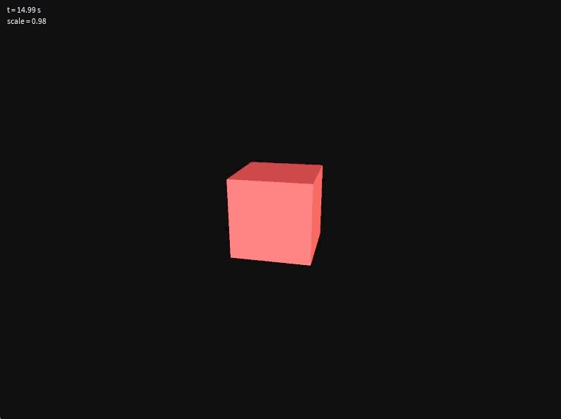
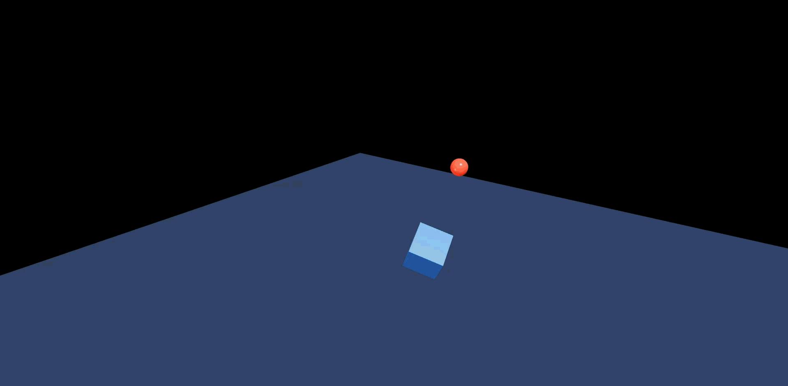

# Taller 0: Transformaciones Geométricas en Computación Visual

Este proyecto implementa transformaciones geométricas básicas (traslación, rotación, escalado) en tres entornos diferentes: **Python/Jupyter**, **Processing**, y **React Three Fiber**. Cada implementación demuestra los conceptos fundamentales de matrices de transformación aplicadas a objetos 2D y 3D.

## 📁 Estructura del Proyecto

```
2025-09-19_taller_0_transformaciones/
├── README.md
├── python/
│   ├── transformacionesBasicas.ipynb    # Jupyter Notebook con transformaciones 2D
│   └── transformaciones.gif             # GIF animado de las transformaciones
├── processing/
│   └── cubo/
│       └── cubo.pde                     # Sketch de Processing con cubo 3D
└── threejs/
    └── threejs/                         # Proyecto Vite + React Three Fiber
        ├── src/
        │   ├── App.tsx
        │   └── components/
        │       └── CanvasScene.tsx      # Escena 3D con animaciones
        └── package.json
```

---

## 🐍 1. Implementación en Python/Jupyter Notebook

### Descripción

Implementación de transformaciones 2D usando **matrices de transformación homogéneas** aplicadas a un cuadrado. Se utilizan las librerías `matplotlib` para visualización y `numpy` para cálculo matricial.

### Características Implementadas

- ✅ **Traslación**: Movimiento del cuadrado en el plano XY
- ✅ **Rotación**: Giro progresivo de 0° a 360°
- ✅ **Escalado**: Aumento de tamaño de 1.0x a 1.8x
- ✅ **Composición de matrices**: T × R × S (Traslación → Rotación → Escalado)
- ✅ **Animación temporal**: Interpolación suave entre estados

### Matrices de Transformación Utilizadas

```python
# Matriz de Traslación
T(tx, ty) = [[1, 0, tx],
             [0, 1, ty],
             [0, 0,  1]]

# Matriz de Rotación
R(θ) = [[cos θ, -sin θ, 0],
        [sin θ,  cos θ, 0],
        [0,      0,     1]]

# Matriz de Escalado
S(sx, sy) = [[sx, 0,  0],
             [0,  sy, 0],
             [0,  0,  1]]
```

### Animación Resultante


> **GIF Animado**: Muestra la evolución temporal del cuadrado aplicando transformaciones combinadas. El cuadrado azul representa el estado original y el rojo el transformado.

### Código Clave

```python
# Composición de transformaciones (orden: Escalar → Rotar → Trasladar)
M = T(tx, ty) @ R(theta) @ S(sx, sy)
pts_transformed = M @ pts_homogeneous
```

**📂 Ver implementación completa**: [`python/transformacionesBasicas.ipynb`](python/transformacionesBasicas.ipynb)

---

## 🎨 2. Implementación en Processing

### Descripción

Sketch de Processing que renderiza un **cubo 3D** con transformaciones animadas en tiempo real. Utiliza las funciones nativas de Processing para transformaciones geométricas.

### Características Implementadas

- ✅ **Traslación senoidal**: Movimiento en trayectoria ondulada (X, Y, Z)
- ✅ **Rotación continua**: Giro en múltiples ejes con velocidades diferentes
- ✅ **Escalado temporal**: Pulsación usando función seno
- ✅ **Iluminación 3D**: Luz ambiental y direccional
- ✅ **Renderizado en tiempo real**: 60 FPS con feedback visual

### Fragmento de Código Principal

```processing
void draw() {
  // Transformaciones basadas en tiempo
  float t = millis() / 1000.0;
  float waveX = sin(t * TWO_PI * 0.6) * 180;  // Traslación senoidal X
  float waveY = sin(t * TWO_PI * 0.4) * 80;   // Traslación senoidal Y
  float rotation = frameCount * 0.02;          // Rotación incremental
  float s = map(sin(t * TWO_PI * 1.2), -1, 1, 0.6, 1.4); // Escalado

  pushMatrix();
  translate(width/2, height/2, 0);
  translate(waveX, waveY, sin(t * 1.5) * 80);
  rotateX(rotation * 0.9);
  rotateY(rotation * 1.3);
  scale(s);

  fill(220, 80, 80);
  box(120);
  popMatrix();
}
```

### Captura de Pantalla



> **Screenshot**: Cubo rojo animado con transformaciones en tiempo real mostrando traslación, rotación y escalado simultáneos.

**📂 Ver código fuente**: [`processing/cubo/cubo.pde`](processing/cubo/cubo.pde)

---

## ⚡ 3. Implementación en React Three Fiber

### Descripción

Aplicación web moderna usando **Vite + React Three Fiber** que implementa una escena 3D interactiva con múltiples objetos animados y controles de navegación.

### Características Implementadas

- ✅ **Trayectorias complejas**: Senoidal + circular para diferentes objetos
- ✅ **Rotación multi-eje**: Velocidades independientes por eje
- ✅ **Escalado temporal**: Función seno para efecto pulsante
- ✅ **OrbitControls**: Navegación interactiva (pan, zoom, rotate)
- ✅ **Iluminación avanzada**: Ambient + Directional + Point lights
- ✅ **Materiales físicos**: PBR con roughness y metalness
- ✅ **Rendering optimizado**: 60 FPS con anti-aliasing

### Objetos Animados

#### 🔷 AnimatedBox (Cubo Principal)

```typescript
useFrame(({ clock }) => {
  const elapsedTime = clock.elapsedTime;

  // Trayectoria senoidal en X, circular en Y-Z
  mesh.position.x = Math.sin(elapsedTime * 0.8) * 3;
  mesh.position.y = Math.cos(elapsedTime * 0.6) * 1.5;
  mesh.position.z = Math.sin(elapsedTime * 0.6) * 1.5;

  // Rotación multi-eje
  mesh.rotation.x += 0.01;
  mesh.rotation.y += 0.015;
  mesh.rotation.z += 0.008;

  // Escalado temporal
  const scale = 0.8 + Math.sin(elapsedTime * 2) * 0.3;
  mesh.scale.setScalar(scale);
});
```

#### 🔴 OrbitingSphere (Esfera Orbitante)

```typescript
useFrame(({ clock }) => {
  const time = clock.elapsedTime;
  const radius = 4;

  // Órbita circular
  mesh.position.x = Math.cos(time * 0.5) * radius;
  mesh.position.z = Math.sin(time * 0.5) * radius;
  mesh.position.y = Math.sin(time * 0.3) * 0.5;

  // Rotación propia
  mesh.rotation.y += 0.02;
});
```

### Captura de Pantalla



> **Screenshot**: Escena interactiva mostrando cubo azul con trayectoria senoidal, esfera roja en órbita, plano de referencia y controles de navegación activos.

### Controles de Navegación

- **🖱️ Click Izquierdo + Arrastrar**: Rotar cámara
- **🖱️ Click Derecho + Arrastrar**: Pan (mover cámara)
- **🎚️ Scroll**: Zoom in/out
- **⚙️ Límites configurados**: Ángulo polar máximo y distancias min/max

**🌐 Ejecutar localmente**:

```bash
cd threejs/threejs
npm install
npm run dev
# Abrir: http://localhost:3000
```

**📂 Ver código fuente**: [`threejs/threejs/src/components/CanvasScene.tsx`](threejs/threejs/src/components/CanvasScene.tsx)

---

## 🔗 Enlaces y Recursos

### Código Fuente Completo

- **Python/Jupyter**: [transformacionesBasicas.ipynb](python/transformacionesBasicas.ipynb)
- **Processing**: [cubo.pde](processing/cubo/cubo.pde)
- **React Three Fiber**: [Proyecto completo](threejs/threejs/)

### Dependencias Utilizadas

- **Python**: `matplotlib`, `numpy`, `imageio`
- **Processing**: Core libraries (P3D renderer)
- **React**: `three`, `@react-three/fiber`, `@react-three/drei`, `vite`

### Conceptos Demostrados

1. **Matrices de Transformación Homogéneas** (2D y 3D)
2. **Composición de Transformaciones** (orden de aplicación)
3. **Interpolación Temporal** para animaciones suaves
4. **Renderizado en Tiempo Real** (60 FPS)
5. **Interactividad** (OrbitControls)
6. **Optimización de Performance** (WebGL/GPU)

---

## 🚀 Cómo Ejecutar

### Python/Jupyter

```bash
cd python/
jupyter notebook transformacionesBasicas.ipynb
```

### Processing

1. Abrir `processing/cubo/cubo.pde` en el IDE de Processing
2. Presionar **Run** (Ctrl+R)

### React Three Fiber

```bash
cd threejs/threejs/
npm install
npm run dev
# Navegar a: http://localhost:3000
```

---

## 📋 Conclusiones

Este taller demuestra la implementación de transformaciones geométricas en tres paradigmas diferentes:

- **Python/Jupyter**: Enfoque matemático y educativo con visualización paso a paso
- **Processing**: Prototipado rápido para arte generativo y visualizaciones interactivas
- **React Three Fiber**: Desarrollo web moderno con rendering 3D de alta performance

Cada implementación tiene sus fortalezas: Python para análisis y comprensión teórica, Processing para experimentación creativa, y React Three Fiber para aplicaciones web profesionales.

Las transformaciones geométricas son fundamentales en computación gráfica, y dominar su implementación en múltiples entornos proporciona una base sólida para proyectos más complejos en visualización, animación, y realidad virtual.

---

**Autor**: Juan Daleman  
**Fecha**: Septiembre 2025  
**Curso**: Computación Visual
