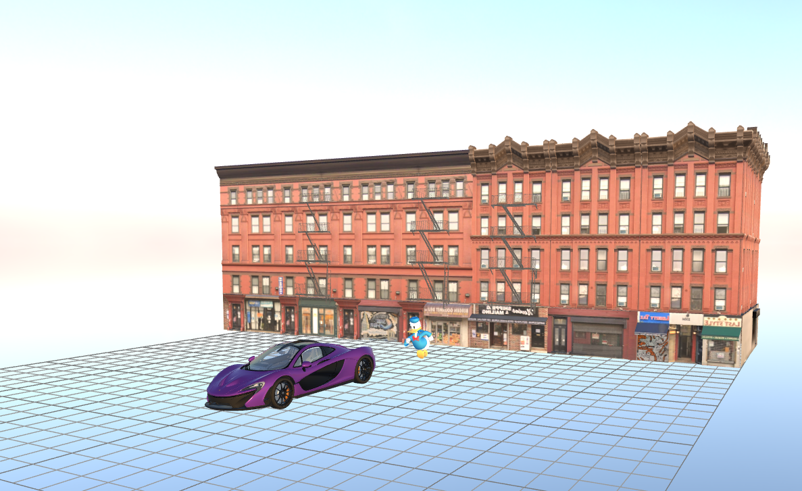

# Taller 1: Materiales, Iluminación y Color en Mundo Virtual 3D

## Descripción del Mundo Virtual

Este proyecto presenta un mundo virtual interactivo que explora la interacción entre materiales PBR, iluminación dinámica y modelos de color. El concepto principal se centra en crear un entorno urbano-futurista donde diferentes tipos de objetos (orgánicos, arquitectónicos y utilitarios) coexisten bajo esquemas de iluminación que transforman la percepción visual de los materiales aplicados.

## Modelos GLB Utilizados

### Modelos Principales:

- **McLaren P1** (`ScaledMclaren.glb`) - Modelo utilitario/automotriz

  - Fuente: Modelo libre de automóvil deportivo
  - Modificaciones: Escalado para proporciones coherentes con la escena
  - Material aplicado: Metal con alta reflectividad y baja rugosidad

- **Edificio Urbano** (`ScaledCity.glb`) - Modelo arquitectónico

  - Fuente: Modelo de edificio moderno
  - Modificaciones: Escalado para servir como elemento de fondo arquitectónico
  - Material aplicado: Concreto con textura procedural y mapas PBR

- **Donald Duck** (`ScaleDonald.glb`) - Modelo orgánico/personaje
  - Fuente: Modelo de personaje animado
  - Modificaciones: Escalado para integración con otros elementos
  - Material aplicado: Materiales cartoon con colores vibrantes

### Escena Completa:

- **Scene Complete** (`scene_complete.glb`) - Composición final exportada desde Three.js Editor
  - Contiene todos los modelos posicionados y con materiales aplicados
  - Incluye piso personalizado con texturas de madera
  - Configuración optimizada para renderizado en tiempo real


_Modelos GLB cargados y organizados en la escena_

### Modelos Adicionales:

- **Iron Man** (`iron_man_rig.glb`) - Modelo de personaje con rigging
- **Modelos base**: `ac_-_mclaren_p1_free.glb`, `city_building.glb`, `donald_duck.glb`

## Esquema de Iluminación

### Configuración de Tres Puntos:

- **Key Light (Luz Principal)**: Luz direccional cálida (temperatura ~3200K) posicionada en ángulo de 45° para crear sombras definidas
- **Fill Light (Luz de Relleno)**: Luz suave fría (temperatura ~5600K) para reducir contraste en sombras
- **Rim Light (Luz de Contorno)**: Luz posterior para separar objetos del fondo y crear profundidad

### Presets de Iluminación:

1. **Preset Día**: Iluminación neutra balanceada con luz ambiental suave
2. **Preset Atardecer**: Tonos cálidos dominantes con contraste acentuado
3. **Preset Noche**: Iluminación fría con tonos azules y contraste alto

### HDRI Environment:

- **Qwantani Sunset**: `qwantani_sunset_puresky_4k.exr` - Ambientación principal utilizada
- **Alternancia dinámica**: Sistema de cambio entre presets mediante botones UI o tecla 'L'


_Esquema de iluminación de tres puntos implementado con HDRI_

## Materiales y Texturas PBR

### Configuración de Materiales:

- **Metal (McLaren)**:

  - Roughness: 0.1-0.3
  - Metalness: 0.9-1.0
  - Normal Map: Para detalles de superficie metálica

- **Concreto (Edificio)**:

  - Roughness: 0.7-0.9
  - Metalness: 0.0
  - Displacement Map: Para relieve arquitectónico

- **Madera (Elementos decorativos)**:
  - Roughness: 0.4-0.6
  - Metalness: 0.0
  - Color Map: Vetas naturales de madera

### Texturas Aplicadas:

- **Metal048B_2K-JPG**: Textura metálica completa con todos los mapas PBR
- **PavingStones067_2K-JPG**: Textura de pavimento con ambient occlusion
- **WoodFloor064_2K-JPG**: Textura de madera con mapas especulares aplicada al piso de la escena


_Configuración de materiales PBR y texturas aplicadas_

## Configuración de Cámaras

### Cámara Perspectiva:

- **FOV**: 50°
- **Posición**: Optimizada para vista panorámica del mundo virtual
- **Propósito**: Proporciona profundidad natural y percepción realista del espacio 3D
- **Controles**: Rotación con mouse, zoom con scroll, controles orbitales

### Cámara Ortográfica:

- **Configuración**: Proyección paralela sin distorsión perspectiva
- **Propósito**: Permite análisis técnico de proporciones y relaciones espaciales exactas
- **Alternancia**: Sistema implementado para cambio dinámico entre vistas mediante tecla 'C' o botones UI


_Vista desde la cámara perspectiva mostrando profundidad natural_


_Vista desde la cámara ortográfica para análisis técnico_

## Modelo de Color

### Paleta Principal (RGB):

- **Colores Primarios**:
  - Azul Metálico: RGB(70, 130, 180) - Para elementos tecnológicos
  - Naranja Cálido: RGB(255, 140, 60) - Para luces de atardecer
  - Gris Neutro: RGB(128, 128, 128) - Para elementos arquitectónicos

### Espacios de Color Utilizados:

- **RGB**: Para definición básica de colores de materiales
- **HSV**: Para ajustes de saturación y brillo en iluminación dinámica
- **Consideraciones CIELAB**: Contraste perceptual optimizado para separación visual de materiales bajo diferentes condiciones de luz

### Justificación Cromática:

La paleta se basa en contrastes complementarios que mantienen legibilidad visual bajo diferentes esquemas de iluminación, utilizando principios de contraste perceptual para asegurar que cada material se distinga claramente en todas las condiciones lumínicas implementadas.

## Animaciones Implementadas

### Sistema de Animaciones de Cámara:

- **Recorrido automático**: Trayectoria suave a través de puntos clave de la escena
- **Interpolación**: Transiciones fluidas usando Tween.js
- **Control manual**: Activación mediante botón UI o tecla 'A'
- **Duración**: 8 segundos de recorrido completo

### Animaciones de Objetos:

- **Rotación continua**: Aplicada a modelos de vehículos
- **Movimiento flotante**: Para personajes y elementos orgánicos
- **Escalado dinámico**: Para elementos arquitectónicos
- **Animaciones de luces**: Movimiento circular y variación de intensidad

### Controles de Animación:

- **Inicio/Pausa**: Control completo de reproducción
- **Reset de escena**: Restauración de posiciones iniciales
- **Animación por categoría**: Cámara, objetos y luces independientes

## Tecnologías Utilizadas

- **Three.js**: Motor de renderizado 3D
- **Vite**: Bundler y servidor de desarrollo
- **Tween.js**: Sistema de animaciones suaves
- **Editor Online Three.js**: Herramienta de desarrollo visual inicial
- **Proyecto Local**: Desarrollo avanzado con control completo
- **Formatos soportados**: GLB/GLTF para modelos 3D, HDR/EXR para mapas de entorno
- **Texturas PBR**: Mapas completos de color, normal, roughness, metalness y displacement

## Estructura del Proyecto

```
2025-10-05_taller_1_materiales_iluminacion_color/
├── threejs/
│   └── project.json
├── threejs/                         # Proyecto Three.js
│   ├── src/
│   │   ├── main.js                  # Aplicación principal
│   │   └── managers/                # Gestores modulares
│   ├── public/                      # Assets públicos
│   ├── package.json
│   └── README.md
├── glb_models/
│   ├── scene_complete.glb           # Escena completa exportada
│   ├── ScaledMclaren.glb
│   ├── ScaledCity.glb
│   ├── ScaleDonald.glb
│   └── [otros modelos]
├── textures/
│   ├── Metal048B_2K-JPG/
│   ├── PavingStones067_2K-JPG/
│   └── WoodFloor064_2K-JPG/
├── hdri/
│   ├── qwantani_sunset_puresky_4k.exr
│   └── zawiszy_czarnego_4k.hdr
├── renders/
│   ├── scene.mp4                    # Video demo de la escena
│   └── images/                      # Capturas del proceso
├── README.md
└── ficha_tecnica.md
```

## Capturas de Pantalla y Video

### Video Demostrativo

**[Video de la Escena Completa](renders/scene.mp4)**

El video muestra:

- Alternancia entre cámaras perspectiva y ortográfica
- Cambios de iluminación en tiempo real
- Animaciones de cámara con recorrido suave
- Interacción con materiales PBR bajo diferentes condiciones de luz

### Proceso de Desarrollo

El desarrollo del proyecto se realizó en dos fases:

1. **Fase Inicial**: Creación en Three.js Editor online

   - Carga y posicionamiento de modelos GLB
   - Aplicación de materiales PBR y texturas
   - Configuración de iluminación básica

2. **Fase Avanzada**: Migración a proyecto local Three.js
   - Implementación completa del sistema de cámaras
   - Desarrollo del sistema de animaciones
   - Optimización de rendimiento y controles

## Controles de Interacción

### Teclado:

- **C**: Alternar entre cámara perspectiva y ortográfica
- **L**: Cambiar presets de iluminación (Día/Atardecer/Noche)
- **A**: Iniciar animaciones de recorrido de cámara
- **R**: Reset de la escena a posición inicial

### Interfaz de Usuario:

- **Panel de Cámaras**: Botones para alternar entre vistas
- **Panel de Iluminación**: Presets de día, atardecer y noche
- **Panel de Animaciones**: Controles para cámara, objetos y luces
- **Panel Debug**: Wireframe, helpers y reset de escena

## Resultado Visual

El mundo virtual resultante demuestra efectivamente cómo la iluminación transforma la percepción de los materiales PBR, creando una experiencia visual coherente que responde dinámicamente a los cambios de luz y cámara. La alternancia entre vistas perspectiva y ortográfica permite apreciar tanto la naturalidad espacial como la precisión técnica del diseño implementado.

El sistema de animaciones proporciona un recorrido cinematográfico que resalta las características principales de cada elemento de la escena, mientras que los controles interactivos permiten explorar libremente el mundo virtual desde diferentes perspectivas y condiciones de iluminación.
