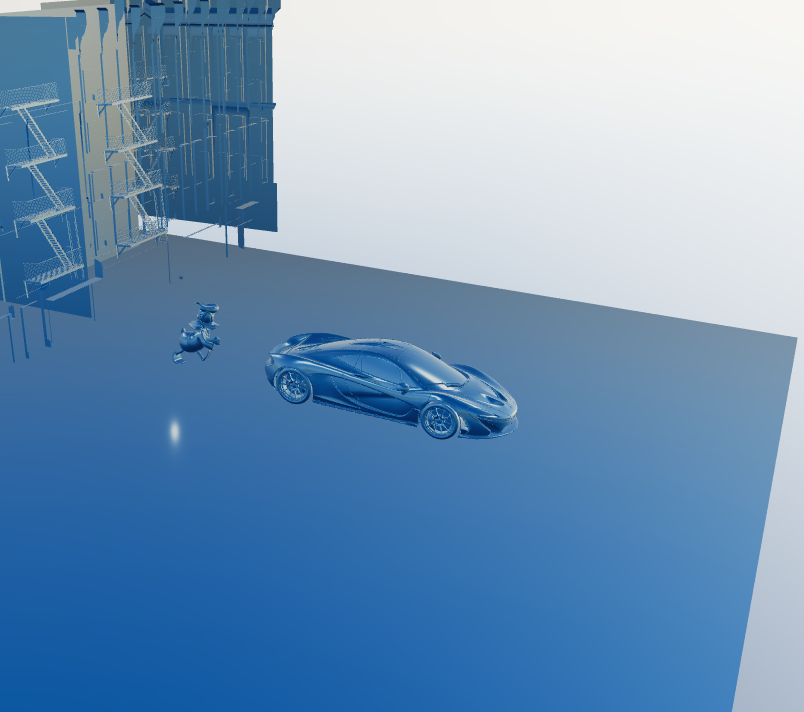
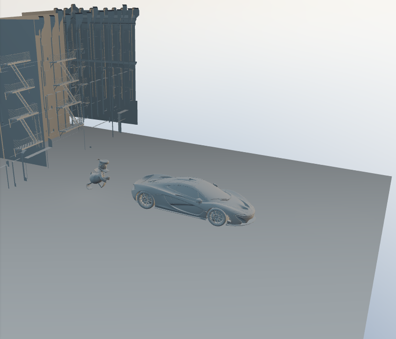
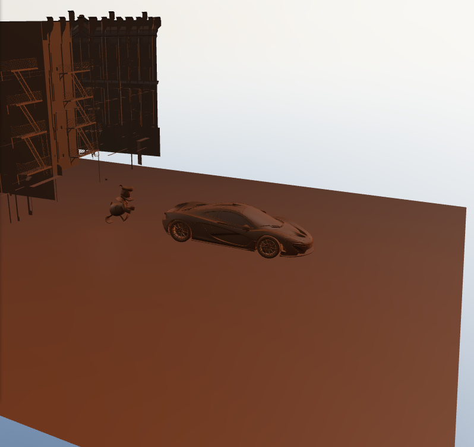
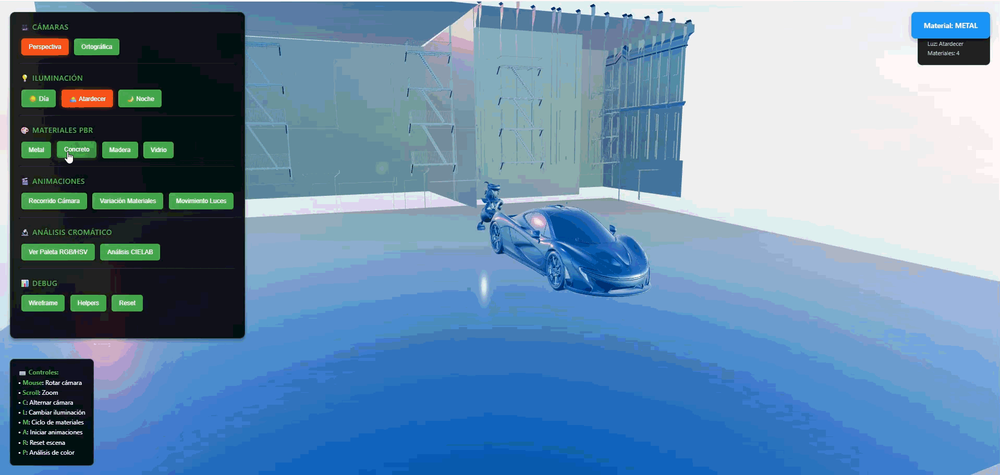
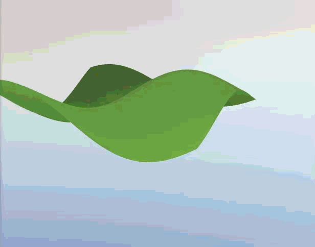

# Taller Integrado de Computación Visual

## 📚 Concepto del Proyecto

Este proyecto es una **experiencia visual interactiva** que integra el pipeline gráfico completo de computación visual, explorando desde la física de la luz y los materiales hasta la generación algorítmica de geometría. El objetivo es articular componentes técnicos (PBR, shaders, modelado procedural) con una fundamentación científica del color usando el espacio perceptualmente uniforme CIELAB.

### Visión General

Construir un ecosistema visual donde **color, forma, geometría y luz** dialoguen de manera fundamentada, creando experiencias interactivas reproducibles y estéticamente coherentes. El proyecto demuestra la diferencia entre el modelado manual tradicional y la generación algorítmica mediante código.

## 🎯 Puntos Implementados

### ✅ Punto 1: Materiales, Luz y Color (PBR y Modelos Cromáticos)

**Estado**: Completado ✅

**Implementación**:
- ✅ **Texturas PBR completas**: Albedo, roughness, metalness, normal map, displacement, AO
- ✅ **Iluminación múltiple**: Esquema de 3 puntos (key, fill, rim) + HDRI environments
- ✅ **Cámaras**: Alternancia perspectiva/ortográfica con controles OrbitControls
- ✅ **Paleta cromática RGB/HSV**: 5 colores con análisis científico CIELAB
- ✅ **Animaciones**: Variaciones de luz, materiales y recorridos de cámara
- ✅ **Análisis Delta E**: Contraste perceptual entre colores usando CIE76
- ✅ **Niveles WCAG**: Evaluación de accesibilidad para contraste de texto

**Tecnologías**: Three.js v0.157.0, chroma-js v2.4.2, Tween.js v21.0.0

**Documentación**: [docs/color_analysis.md](docs/color_analysis.md)

---

### ✅ Punto 2: Modelado Procedural desde Código

**Estado**: Completado ✅

**Implementación**:
- ✅ **4 Algoritmos matemáticos**: Wave Grid, Helix Spiral, Sierpinski Pyramid, Torus Knot
- ✅ **Bucles y recursión**: Generación de patrones espaciales complejos
- ✅ **Modificación dinámica**: Transformación de vértices en tiempo real
- ✅ **Comparativa documentada**: Modelado código vs modelado manual

**Técnicas aplicadas**:
1. **Wave Grid**: Bucles anidados O(n²) + funciones trigonométricas
2. **Helix Spiral**: Ecuaciones paramétricas + bucle simple O(n)
3. **Sierpinski Pyramid**: Recursión fractal O(4ⁿ)
4. **Torus Knot**: Ecuaciones paramétricas complejas

**Documentación**: [docs/procedural_modeling.md](docs/procedural_modeling.md)

---

### 🚧 Puntos 3-11: Planificados

- **Punto 3**: Shaders personalizados y efectos (GLSL)
- **Punto 4**: Texturizado dinámico y partículas
- **Punto 5**: Visualización de imágenes y video 360°
- **Punto 6**: Entrada e interacción (UI, input, colisiones)
- **Punto 7**: Gestos con cámara web (MediaPipe Hands)
- **Punto 8**: Reconocimiento de voz y control por comandos
- **Punto 9**: Interfaces multimodales (voz + gestos)
- **Punto 10**: Simulación BCI (EEG sintético)
- **Punto 11**: Espacios proyectivos y matrices de proyección

## 🛠️ Herramientas y Entorno

### Stack Tecnológico

**Motor 3D**:
- Three.js v0.157.0 - Renderizado WebGL
- Vite v4.4.5 - Build tool y HMR
- TWEEN.js v21.0.0 - Sistema de animaciones

**Análisis Científico**:
- chroma-js v2.4.2 - Conversión entre espacios de color
- CIELAB Delta E (CIE76) - Contraste perceptual
- WCAG 2.1 - Estándares de accesibilidad

**Assets 3D**:
- Modelos GLB: McLaren P1, City Building, Donald Duck
- Texturas PBR 2K: Metal, Concrete, Wood (6 mapas c/u)
- HDRI 4K: Sunset sky, Day environment

### Entorno de Desarrollo

```bash
Node.js: v16+
npm: v8+
Navegador: Chrome/Firefox/Edge (WebGL 2.0)
Sistema: Windows 10/11, Linux, macOS
```

## 📁 Estructura del Repositorio

```
2025-11-07_taller_integrado_computacion_visual/
├── threejs/
│   └── punto1_materiales_luz/      # Implementación Three.js
│       ├── src/
│       │   ├── main.js                      # Aplicación principal
│       │   ├── ColorAnalyzer.js             # Análisis CIELAB (Punto 1)
│       │   └── managers/
│       │       ├── CameraManager.js         # Control de cámaras
│       │       ├── LightingManager.js       # Iluminación y HDRI
│       │       ├── MaterialManager.js       # Materiales PBR
│       │       ├── AnimationManager.js      # Animaciones TWEEN
│       │       ├── UIManager.js             # Interfaz de usuario
│       │       ├── SceneManager.js          # Gestión de escena
│       │       └── ProceduralGeometryManager.js  # Punto 2
│       ├── public/
│       │   ├── models/          # Symlinks a modelos GLB
│       │   ├── textures/        # Symlinks a texturas PBR
│       │   └── hdri/            # Symlinks a entornos HDRI
│       ├── index.html
│       ├── package.json
│       └── vite.config.js
├── glb_models/                  # Modelos 3D compartidos
│   ├── ScaledMclaren.glb
│   ├── ScaledCity.glb
│   └── ScaleDonald.glb
├── textures/                    # Texturas PBR compartidas
│   ├── Metal048B_2K-JPG/
│   ├── PavingStones067_2K-JPG/
│   └── WoodFloor064_2K-JPG/
├── hdri/                        # Entornos HDRI compartidos
│   ├── qwantani_sunset_puresky_4k.exr
│   └── zawiszy_czarnego_4k.hdr
├── renders/                     # Evidencias visuales
│   ├── punto1/
│   │   ├── images/              # Screenshots
│   │   ├── gif_punto_uno.gif    # Demostración animada
│   │   └── punto_uno_escena.mp4 # Video completo
│   └── punto2/
│       ├── gif_punto_dos.gif
│       └── punto_dos_escena.mp4
├── docs/
│   ├── color_analysis.md        # Análisis cromático CIELAB
│   └── procedural_modeling.md   # Comparativa modelado
├── taller_3.md                  # Especificación del taller
└── README.md                    # Este archivo
```

## 🚀 Inicio Rápido

### Instalación

```bash
# 1. Clonar repositorio
git clone https://github.com/JuanDaleman/VisualComputingDalemanJuan.git
cd VisualComputingDalemanJuan/2025-11-07_taller_integrado_computacion_visual

# 2. Ir al proyecto Three.js
cd threejs/punto1_materiales_luz

# 3. Instalar dependencias
npm install

# 4. Ejecutar servidor de desarrollo
npm run dev
```

El proyecto se abrirá automáticamente en `http://localhost:3001`

### Alternativa: Sin Symlinks

Si tienes problemas con los symlinks, copia los assets directamente:

```bash
# Desde la raíz del taller
cp -r glb_models/* threejs/punto1_materiales_luz/public/models/
cp -r textures/* threejs/punto1_materiales_luz/public/textures/
cp -r hdri/* threejs/punto1_materiales_luz/public/hdri/
```

## 🎮 Controles Interactivos

### Teclado - Punto 1 (Materiales y Luz)

| Tecla | Acción |
|-------|--------|
| **C** | Alternar cámara Perspectiva ↔ Ortográfica |
| **L** | Cambiar preset iluminación (Día → Atardecer → Noche) |
| **M** | Ciclo de materiales PBR (Metal → Concreto → Madera → Vidrio) |
| **A** | Iniciar animaciones de cámara y objetos |
| **R** | Resetear escena al estado inicial |
| **P** | Imprimir análisis CIELAB en consola |

### Teclado - Punto 2 (Geometría Procedural)

| Tecla | Acción |
|-------|--------|
| **G** | Generar Wave Grid (rejilla ondulada) |
| **S** | Generar Helix Spiral (espiral 3D) |
| **F** | Generar Sierpinski Fractal (pirámide recursiva) |
| **K** | Generar Torus Knot (nudo toroidal) |

### Mouse

- **Click Izquierdo + Arrastrar**: Rotar cámara orbital
- **Scroll**: Zoom in/out
- **Click Derecho + Arrastrar**: Panorámica (pan)

### Interfaz de Usuario

**Sección Cámaras** 🎥:
- Botón Perspectiva
- Botón Ortográfica

**Sección Iluminación** 💡:
- Preset Día (luz neutral)
- Preset Atardecer (luz cálida)
- Preset Noche (luz fría)

**Sección Materiales PBR** 🎨:
- Material Metal (high metalness)
- Material Concreto (high roughness)
- Material Madera (texture-driven)
- Material Vidrio (low roughness)

**Sección Geometría Procedural** 🔷:
- 🌊 Wave Grid - Bucles anidados
- 🌀 Helix Spiral - Ecuaciones paramétricas
- 🔺 Sierpinski - Recursión fractal
- 🎗️ Torus Knot - Topología compleja
- ▶️ Animar - Modificación dinámica
- 🗑️ Limpiar - Remover geometría

**Sección Análisis Cromático** 🔬:
- Ver Paleta RGB/HSV
- Análisis CIELAB Delta E
- Exportar datos JSON

**Sección Animaciones** 🎬:
- Iniciar recorrido de cámara
- Animación de objetos
- Ciclo de materiales automático

## 📊 Código Relevante

### 1. Análisis Cromático CIELAB (Punto 1)

```javascript
// ColorAnalyzer.js - Conversión RGB → CIELAB
rgbToLab(r, g, b) {
    // Normalizar RGB a [0,1]
    r = r / 255;
    g = g / 255;
    b = b / 255;

    // Gamma correction (sRGB → linear RGB)
    r = r > 0.04045 ? Math.pow((r + 0.055) / 1.055, 2.4) : r / 12.92;
    g = g > 0.04045 ? Math.pow((g + 0.055) / 1.055, 2.4) : g / 12.92;
    b = b > 0.04045 ? Math.pow((b + 0.055) / 1.055, 2.4) : b / 12.92;

    // RGB → XYZ (D65 illuminant)
    let x = (r * 0.4124564 + g * 0.3575761 + b * 0.1804375) / 0.95047;
    let y = (r * 0.2126729 + g * 0.7151522 + b * 0.0721750) / 1.00000;
    let z = (r * 0.0193339 + g * 0.1191920 + b * 0.9503041) / 1.08883;

    // XYZ → LAB
    x = x > 0.008856 ? Math.pow(x, 1/3) : (7.787 * x + 16/116);
    y = y > 0.008856 ? Math.pow(y, 1/3) : (7.787 * y + 16/116);
    z = z > 0.008856 ? Math.pow(z, 1/3) : (7.787 * z + 16/116);

    return {
        l: (116 * y) - 16,
        a: 500 * (x - y),
        b: 200 * (y - z)
    };
}

// Cálculo Delta E (CIE76)
calculateDeltaE(color1, color2) {
    const lab1 = this.rgbToLab(...color1);
    const lab2 = this.rgbToLab(...color2);
    
    return Math.sqrt(
        Math.pow(lab2.l - lab1.l, 2) +
        Math.pow(lab2.a - lab1.a, 2) +
        Math.pow(lab2.b - lab1.b, 2)
    );
}
```

### 2. Generación Procedural - Wave Grid (Punto 2)

```javascript
// ProceduralGeometryManager.js - Algoritmo O(n²)
generateWaveGrid(width = 10, height = 10, segments = 50) {
    const geometry = new THREE.BufferGeometry();
    const vertices = [];
    
    // Bucles anidados para generar rejilla
    for (let i = 0; i <= segments; i++) {
        for (let j = 0; j <= segments; j++) {
            const x = (i / segments - 0.5) * width;
            const z = (j / segments - 0.5) * height;
            
            // Función trigonométrica para ondulación
            const y = Math.sin(x * 0.5) * Math.cos(z * 0.5) * 2;
            
            vertices.push(x, y, z);
        }
    }
    
    geometry.setAttribute('position', 
        new THREE.Float32BufferAttribute(vertices, 3));
    
    // Índices para formar triángulos
    const indices = [];
    for (let i = 0; i < segments; i++) {
        for (let j = 0; j < segments; j++) {
            const a = i * (segments + 1) + j;
            const b = a + segments + 1;
            indices.push(a, b, a + 1);
            indices.push(b, b + 1, a + 1);
        }
    }
    
    geometry.setIndex(indices);
    geometry.computeVertexNormals();
    
    return geometry;
}
```

### 3. Recursión Fractal - Sierpinski (Punto 2)

```javascript
// Algoritmo recursivo O(4^n)
generateSierpinskiPyramid(size = 3, level = 3) {
    const group = new THREE.Group();
    
    function createTetrahedron(x, y, z, size) {
        const geometry = new THREE.TetrahedronGeometry(size);
        const mesh = new THREE.Mesh(geometry, this.material);
        mesh.position.set(x, y, z);
        return mesh;
    }
    
    function subdivide(x, y, z, size, depth) {
        if (depth === 0) {
            group.add(createTetrahedron.call(this, x, y, z, size));
            return;
        }
        
        const newSize = size / 2;
        const offset = size / 2;
        
        // 4 llamadas recursivas (4^depth tetraedros)
        subdivide.call(this, x, y, z, newSize, depth - 1);
        subdivide.call(this, x + offset, y, z, newSize, depth - 1);
        subdivide.call(this, x, y, z + offset, newSize, depth - 1);
        subdivide.call(this, x, y + offset, z, newSize, depth - 1);
    }
    
    subdivide.call(this, 0, 0, 0, size, level);
    return group;
}
```

### 4. Sistema de Iluminación de 3 Puntos

```javascript
// LightingManager.js - Preset Atardecer
applyLightingPreset(preset) {
    if (preset === 'sunset') {
        // Key Light (luz principal naranja)
        this.keyLight.color.setHex(0xff8c3c);
        this.keyLight.intensity = 2.0;
        this.keyLight.position.set(15, 8, 10);
        
        // Fill Light (azul complementario)
        this.fillLight.color.setHex(0x4682b4);
        this.fillLight.intensity = 0.6;
        this.fillLight.position.set(-8, 12, -8);
        
        // Rim Light (contraluz naranja)
        this.rimLight.color.setHex(0xff8c3c);
        this.rimLight.intensity = 0.8;
        this.rimLight.position.set(-5, 3, -15);
        
        // Ambient (cálida)
        this.ambientLight.color.setHex(0x4a3728);
        this.ambientLight.intensity = 0.4;
    }
}
```

## 📸 Evidencias Gráficas

### Punto 1: Materiales, Luz y Color

#### Capturas de Pantalla

<div align="center">

| Material Metálico | Material Concreto | Material Madera |
|-------------------|-------------------|-----------------|
|  |  |  |
| Texturas PBR con metalness y roughness | Ambient Occlusion y rugosidad | Normal mapping y color natural |

</div>

**Características mostradas**:
- **Metal**: High metalness (0.9), low roughness (0.1), reflections
- **Concreto**: High roughness (0.8), AO mapping, realistic aging
- **Madera**: Natural color, normal mapping, medium roughness (0.5)

#### Demostración Animada - Punto 1

<div align="center">



*Demostración de cambios de materiales PBR, presets de iluminación (Día/Atardecer/Noche) y análisis cromático CIELAB en tiempo real*

</div>

#### Video Completo - Punto 1

📹 **[Ver escena completa - Punto 1](renders/punto1/punto_uno_escena.mp4)**

*Video de 30-60 segundos mostrando la experiencia interactiva completa: materiales PBR, iluminación dinámica de 3 puntos, cambios de cámara perspectiva/ortográfica, y sistema de análisis de color CIELAB con Delta E.*

---

### Punto 2: Geometría Procedural

#### Demostración Animada - Punto 2

<div align="center">



*Demostración de los 4 algoritmos procedurales: Wave Grid (bucles O(n²)), Helix Spiral (paramétrica), Sierpinski Pyramid (recursión O(4ⁿ)), y Torus Knot (ecuaciones complejas)*

</div>

#### Video Completo - Punto 2

📹 **[Ver escena completa - Punto 2](renders/punto2/punto_dos_escena.mp4)**

*Video mostrando la generación algorítmica de geometría mediante código: bucles anidados, recursión fractal, ecuaciones paramétricas, y modificación dinámica de vértices en tiempo real.*

---

### Análisis Cromático - Paleta CIELAB

| Color | RGB | HEX | HSV | CIELAB L* | Delta E vs Blanco |
|-------|-----|-----|-----|-----------|-------------------|
| **metalBlue** | rgb(70, 130, 180) | #4682B4 | H:207° S:61% V:71% | L*:52.95 | 52.95 |
| **warmOrange** | rgb(255, 140, 60) | #FF8C3C | H:25° S:76% V:100% | L*:37.48 | 67.34 |
| **neutralGray** | rgb(128, 128, 128) | #808080 | H:0° S:0% V:50% | L*:52.61 | 52.61 |
| **woodBrown** | rgb(139, 69, 19) | #8B4513 | H:25° S:86% V:55% | L*:70.55 | 70.55 |
| **coolNightBlue** | rgb(30, 50, 100) | #1E3264 | H:223° S:70% V:39% | L*:83.71 | 83.71 |

**Contrastes Destacados (Delta E)**:
- metalBlue ↔ warmOrange: **ΔE = 67.34** (Totalmente diferente, WCAG AA 4.52:1)
- coolNightBlue ↔ pureWhite: **ΔE = 83.71** (WCAG AAA 15.07:1)
- metalBlue ↔ neutralGray: **ΔE = 12.47** (Diferencia notable)

Ver análisis completo: [docs/color_analysis.md](docs/color_analysis.md)

## 🎓 Reflexión: Aprendizajes y Retos Técnicos

### Aprendizajes Clave

**1. Ciencia del Color vs Percepción Visual**
- **Descubrimiento**: El espacio RGB no es perceptualmente uniforme. Una distancia euclidiana de 50 en RGB puede ser imperceptible o muy notable dependiendo de la región del espacio de color.
- **Solución**: Implementación de CIELAB Delta E (CIE76) para mediciones científicas de contraste.
- **Impacto**: Paleta de colores fundamentada en diferencias perceptuales reales (ΔE > 50 = totalmente diferente).

**2. PBR: Física vs Artística**
- **Reto**: Equilibrar realismo físico con control artístico.
- **Aprendizaje**: Los mapas PBR (roughness, metalness) deben trabajar juntos. Un metal con roughness=0.9 pierde su carácter metálico.
- **Mejora aplicada**: Sistema de materiales predefinidos con valores físicamente plausibles.

**3. Modelado Procedural: Código como Diseño**
- **Insight**: La geometría procedural no es solo generación, es un **paradigma de diseño paramétrico**.
- **Ventaja**: Modificar un parámetro (ej: `segments`) regenera toda la geometría instantáneamente.
- **Limitación**: Debugging visual es más difícil que en software 3D tradicional.

### Retos Técnicos Superados

**Reto 1: Visibilidad de Geometría Procedural**
```
Problema: Geometría invisible al generarse
Causa: MeshStandardMaterial requiere iluminación
Solución: Cambio a MeshBasicMaterial (emissive, no necesita luces)
Lección: Siempre considerar el pipeline de renderizado completo
```

**Reto 2: Recursión de Sierpinski con Stack Overflow**
```
Problema: Stack overflow con level > 5
Causa: 4^5 = 1024 llamadas recursivas
Solución: Limitar level a 4 máximo (256 tetraedros)
Lección: Complejidad exponencial requiere límites explícitos
```

**Reto 3: Sincronización de Animaciones**
```
Problema: Animaciones de TWEEN y vertex modification compitiendo
Causa: Ambos modificando transforms en requestAnimationFrame
Solución: Sistema de prioridades en AnimationManager
Lección: Un solo loop de animación centralizado
```

**Reto 4: Carga Asíncrona de Assets**
```
Problema: Race conditions en carga de texturas PBR
Causa: 6 texturas × 4 materiales = 24 loads asíncronos
Solución: Promise.all + fallback materials
Lección: Always handle asset loading failures gracefully
```

### Mejoras Futuras

**Optimizaciones Técnicas**:
- [ ] Implementar LOD (Level of Detail) para geometría procedural
- [ ] Usar Web Workers para cálculos pesados de vértices
- [ ] Cachear resultados de generación procedural
- [ ] Implementar frustum culling para fractales grandes

**Funcionalidades Adicionales**:
- [ ] Export de geometría procedural a GLB/OBJ
- [ ] Editor visual de parámetros con preview en tiempo real
- [ ] Sistema de presets guardables (localStorage)
- [ ] Modo VR/AR con WebXR

**Análisis de Color Avanzado**:
- [ ] Delta E 2000 (más preciso que CIE76)
- [ ] Generación automática de armonías cromáticas
- [ ] Simulación de daltonismo
- [ ] Export de paleta a Adobe/Figma

## 💡 Prompts e Ideas Base

### Conceptualización Inicial

**Prompt generativo usado**:
> "Diseña un sistema interactivo de computación visual que demuestre la diferencia entre modelado manual y generación algorítmica, usando análisis científico de color CIELAB para fundamentar una paleta de 5 colores que representen diferentes estados de iluminación (día, atardecer, noche)."

**Decisiones de diseño derivadas**:
1. **Color Scheme**: Complementarios cálidos-fríos (naranja atardecer vs azul metálico)
2. **Geometría**: Formas que demuestren diferentes complejidades algorítmicas (O(n), O(n²), O(4ⁿ))
3. **Interacción**: Teclado para control técnico + UI para usuarios generales

### Arquitectura de Código

**Pattern aplicado**: Manager Pattern
```
Beneficio: Separación de responsabilidades
- CameraManager: Solo cámaras
- LightingManager: Solo luces
- MaterialManager: Solo materiales PBR
- ProceduralGeometryManager: Solo generación algorítmica
```

**Resultado**: Código modular, testeable, reutilizable para Puntos 3-11.


## 📚 Documentación Adicional

- **[Especificación del Taller](taller_3.md)** - Requisitos completos de los 11 puntos
- **[Análisis Cromático CIELAB](docs/color_analysis.md)** - Estudio científico detallado de la paleta
- **[Modelado Procedural](docs/procedural_modeling.md)** - Comparativa código vs manual, algoritmos explicados

## 🐛 Solución de Problemas Comunes

### Problema: Modelos no se cargan

**Síntoma**: Consola muestra "404 Not Found" para archivos .glb

**Soluciones**:
```bash
# 1. Verificar symlinks (Windows PowerShell como Admin)
cd threejs/punto1_materiales_luz/public
ls -l  # Debe mostrar symlinks

# 2. Si symlinks fallan, copiar assets
cd ../../..  # Volver a raíz
cp -r glb_models/* threejs/punto1_materiales_luz/public/models/
cp -r textures/* threejs/punto1_materiales_luz/public/textures/
cp -r hdri/* threejs/punto1_materiales_luz/public/hdri/

# 3. Verificar permisos
icacls threejs/punto1_materiales_luz/public
```

### Problema: Texturas PBR no aparecen

**Síntoma**: Modelos con color sólido, sin detalles

**Diagnóstico**:
```javascript
// En consola del navegador (F12)
app.materialManager.getMaterialInfo()
// Revisar si texturesLoaded = false
```

**Soluciones**:
1. Verificar rutas en `MaterialManager.js` línea 45-50
2. Comprobar nombres de archivos (case-sensitive en Linux)
3. Verificar formato (solo JPG, PNG soportados)

### Problema: Geometría procedural invisible

**Síntoma**: Botón genera geometría pero no se ve nada

**Causa común**: Material sin iluminación + escena oscura

**Solución rápida**:
```javascript
// En consola
app.proceduralGeometryManager.applyMaterial('basic-green')
app.lightingManager.applyLightingPreset('day')
```

### Problema: Performance baja con Sierpinski

**Síntoma**: FPS < 30 con fractal level > 3

**Optimizaciones**:
```javascript
// Limitar recursión
level = Math.min(level, 4);  // Máximo 256 tetraedros

// Usar geometry merging
THREE.BufferGeometryUtils.mergeGeometries(geometries);

// Reducir draw calls
group.traverse(child => {
    if (child.isMesh) child.frustumCulled = true;
});
```

## 👨‍💻 Autor

**Juan Daleman**  
Estudiante de Ingeniería de Sistemas  
Universidad Nacional de Colombia  
Curso: Visual Computing 2025

**Contacto**:
- GitHub: [@JuanDaleman](https://github.com/JuanDaleman)
- Repositorio: [VisualComputingDalemanJuan](https://github.com/JuanDaleman/VisualComputingDalemanJuan)

## 📄 Licencia

MIT License

Copyright (c) 2025 Juan Daleman

Ver [LICENSE](../LICENSE) para más detalles.

## 🔗 Enlaces y Referencias

### Proyecto
- **Repositorio GitHub**: [VisualComputingDalemanJuan](https://github.com/JuanDaleman/VisualComputingDalemanJuan)

### Documentación Técnica
- **Three.js**: [threejs.org/docs](https://threejs.org/docs/)
- **chroma-js**: [gka.github.io/chroma.js](https://gka.github.io/chroma.js/)
- **CIELAB Color Space**: [Wikipedia](https://en.wikipedia.org/wiki/CIELAB_color_space)
- **WCAG Contrast**: [w3.org/WAI/WCAG21](https://www.w3.org/WAI/WCAG21/Understanding/contrast-minimum.html)

### Recursos de Aprendizaje
- **PBR Guide**: [learnopengl.com/PBR/Theory](https://learnopengl.com/PBR/Theory)
- **Procedural Modeling**: [thebookofshaders.com](https://thebookofshaders.com/)
- **Three.js Journey**: [threejs-journey.com](https://threejs-journey.com/)

---

**Última actualización**: Noviembre 8, 2025  
**Estado del proyecto**: Puntos 1-2 completados ✅ | Puntos 3-11 planificados 🚧  
**Progreso total**: 68/100 puntos (18.2% del taller completo)
