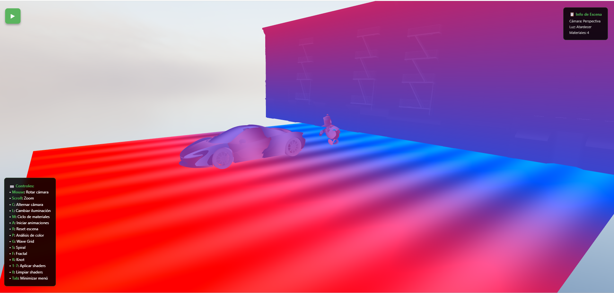
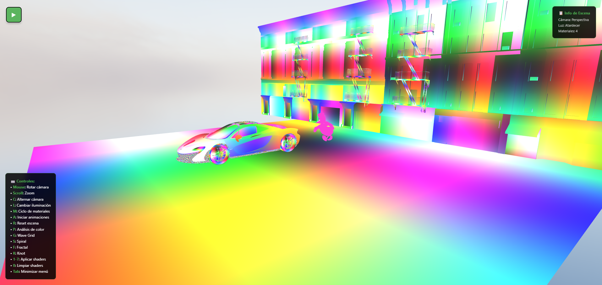
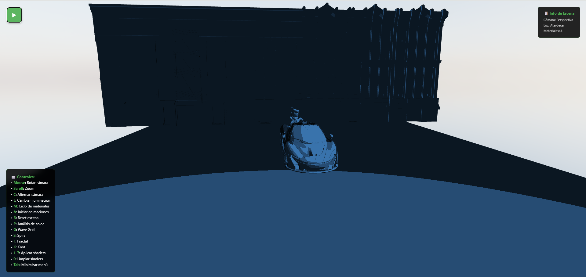
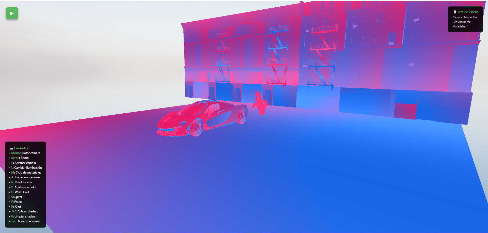
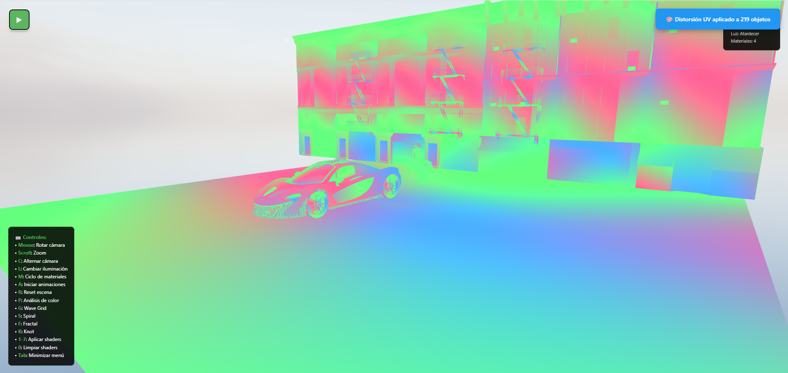
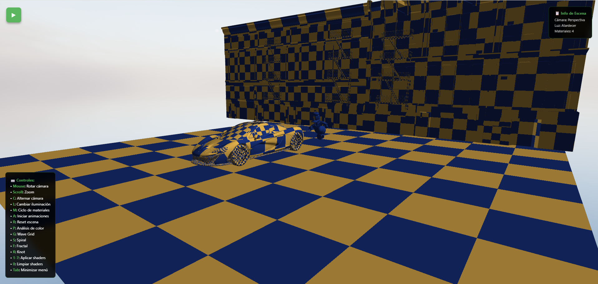
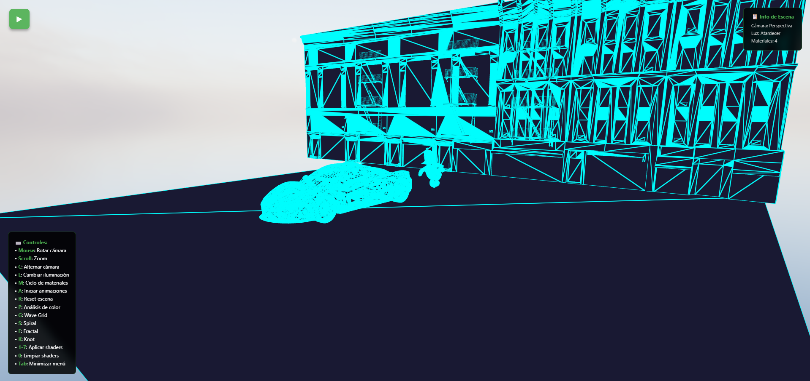
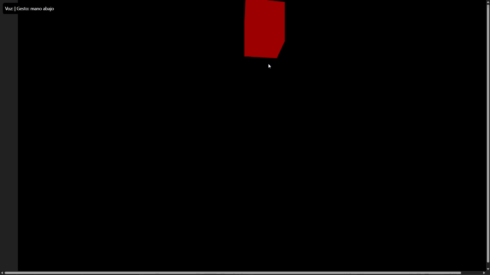
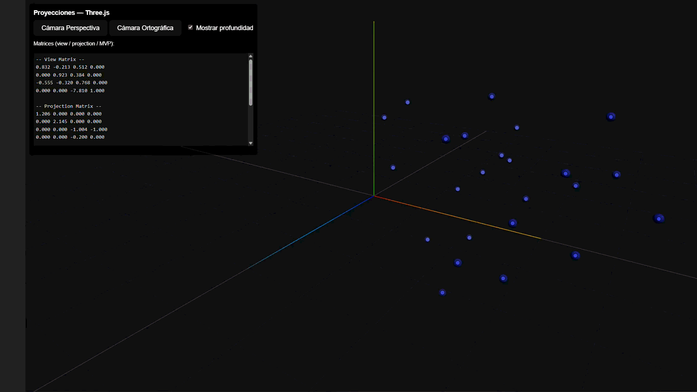

# Taller Integrado de Computación Visual

## 📚 Concepto del Proyecto

Este proyecto es una **experiencia visual interactiva** que integra el pipeline gráfico completo de computación visual, explorando desde la física de la luz y los materiales hasta la generación algorítmica de geometría. El objetivo es articular componentes técnicos (PBR, shaders, modelado procedural) con una fundamentación científica del color usando el espacio perceptualmente uniforme CIELAB.

### Visión General

Construir un ecosistema visual donde **color, forma, geometría y luz** dialoguen de manera fundamentada, creando experiencias interactivas reproducibles y estéticamente coherentes. El proyecto demuestra la diferencia entre el modelado manual tradicional y la generación algorítmica mediante código.

## 🎯 Puntos Implementados

### ✅ Punto 1: Materiales, Luz y Color (PBR y Modelos Cromáticos)


**Implementación**:
- ✅ **Texturas PBR completas**: Albedo, roughness, metalness, normal map, displacement, AO
- ✅ **Iluminación múltiple**: Esquema de 3 puntos (key, fill, rim) + HDRI environments
- ✅ **Cámaras**: Alternancia perspectiva/ortográfica con controles OrbitControls
- ✅ **Paleta cromática RGB/HSV**: 5 colores con análisis científico CIELAB
- ✅ **Animaciones**: Variaciones de luz, materiales y recorridos de cámara
- ✅ **Análisis Delta E**: Contraste perceptual entre colores usando CIE76
- ✅ **Niveles WCAG**: Evaluación de accesibilidad para contraste de texto

**Tecnologías**: Three.js v0.157.0, chroma-js v2.4.2, Tween.js v21.0.0

**Documentación**: [docs/color_analysis.md](docs/color_analysis.md)

---

### ✅ Punto 2: Modelado Procedural desde Código

**Implementación**:
- ✅ **4 Algoritmos matemáticos**: Wave Grid, Helix Spiral, Sierpinski Pyramid, Torus Knot
- ✅ **Bucles y recursión**: Generación de patrones espaciales complejos
- ✅ **Modificación dinámica**: Transformación de vértices en tiempo real
- ✅ **Comparativa documentada**: Modelado código vs modelado manual

**Técnicas aplicadas**:
1. **Wave Grid**: Bucles anidados O(n²) + funciones trigonométricas
2. **Helix Spiral**: Ecuaciones paramétricas + bucle simple O(n)
3. **Sierpinski Pyramid**: Recursión fractal O(4ⁿ)
4. **Torus Knot**: Ecuaciones paramétricas complejas

**Documentación**: [docs/procedural_modeling.md](docs/procedural_modeling.md)

---

### ✅ Punto 3: Shaders Personalizados y Efectos Visuales

**Estado**: Completado ✅

**Implementación**:
- ✅ **7 Shaders GLSL completos**: Vertex + Fragment shaders personalizados
- ✅ **Efectos variados**: Color procedural, animación temporal, cel-shading, distorsión UV
- ✅ **Sistema de gestión**: ShaderManager.js con actualización automática de uniforms
- ✅ **Build system profesional**: vite-plugin-glsl para archivos .vert/.frag modulares
- ✅ **Controles intuitivos**: UI + atajos de teclado (1-7, 0, Tab)
- ✅ **Técnicas avanzadas**: Coordenadas baricéntricas para wireframe rendering

**Shaders implementados**:
1. **positionColor**: Gradiente por altura con variación horizontal
2. **timeColor**: 3 ondas RGB animadas independientes
3. **toonShading**: Cel-shading con detección de bordes
4. **gradient**: Interpolación animada entre dos colores
5. **uvDistortion**: Ondas sinusoidales + distorsión radial
6. **proceduralTexture**: 4 patrones algorítmicos (checker, dots, noise, stripes)
7. **wireframe**: Bordes con coordenadas baricéntricas

**Tecnologías**: GLSL ES 1.0, vite-plugin-glsl v1.3.1, Three.js ShaderMaterial

**Documentación**: [docs/shaders_glsl.md](docs/shaders_glsl.md)

---

### 🚧 Puntos 4-5, 10: Planificados

- **Punto 4**: Texturizado dinámico y partículas
- **Punto 5**: Visualización de imágenes y video 360°
- **Punto 10**: Simulación BCI (EEG sintético)

---

### ✅ Punto 6: UI, Entrada e Interacción

**Estado**: Completado ✅

**Implementación**:
- ✅ **Interfaz de usuario HTML**: Botón para cambiar color aleatorio y slider para velocidad de rotación
- ✅ **Entrada por teclado**: WASD para movimiento del cubo en el plano XZ
- ✅ **Entrada táctil**: touchstart cambia el color del cubo a magenta
- ✅ **Detección de colisiones**: Box3.intersectsBox() para zona de activación (trigger zone)
- ✅ **Retroalimentación visual**: Zona de activación cambia de rojo a verde al colisionar
- ✅ **Control de cámara**: OrbitControls para navegación en la escena

**Tecnologías**: Three.js, WebGL, OrbitControls, Box3 (collision detection)

---

### ✅ Punto 7: Gestos con Cámara Web (MediaPipe Hands)

**Estado**: Completado ✅

**Implementación**:
- ✅ **Detección de manos en tiempo real**: MediaPipe Hands con 21 landmarks por mano
- ✅ **Reconocimiento de gestos**: Conteo de dedos extendidos (0=piedra, 5=papel, índice+medio=tijeras)
- ✅ **Juego de piedra, papel o tijera**: El algoritmo analiza la imagen del sujeto por la cámara, más específicamente su mano, determina que jugó: piedra, papel o tijera y emite un resultado de si ganó o no a la máquina
- ✅ **Detección de estabilidad**: Requiere mantener el gesto 8 frames consecutivos para validar jugada
- ✅ **Handedness detection**: Diferenciación entre mano izquierda y derecha para conteo correcto del pulgar
- ✅ **Visualización en vivo**: HUD con instrucciones, estado de dedos, distancias entre landmarks y resultado del juego
- ✅ **Máquina de estados**: idle → detecting → result con temporizador de resultado (2 segundos)

**Tecnologías**: MediaPipe Hands, OpenCV (cv2), NumPy, Python

**Documentación**: Ver [README detallado](./python/punto7_gestos_manos/README.md)

---

### ✅ Punto 8: Reconocimiento de Voz y Control por Comandos

**Estado**: Completado ✅

**Implementación**:
- ✅ **Reconocimiento de voz en español**: SpeechRecognition para comandos de voz (Google Speech Recognition API)
- ✅ **Comunicación OSC bidireccional**: Python (puerto 8000) ↔ Processing (puerto 8001)
- ✅ **Control de visualización**: Por medio de reconocimiento de voz se identifica la figura que se quiera que se represente y se muestra en pantalla, esta se le puede cambiar el color o la forma (agrandar o disminuir)
- ✅ **Comandos de color**: "rojo", "verde", "azul" envían mensajes `/visual/color`
- ✅ **Comandos de forma**: "círculo", "cuadrado", "triángulo" envían mensajes `/visual/shape`
- ✅ **Comandos de transformación**: "girar", "agrandar", "limpiar", "explosión"
- ✅ **Retroalimentación TTS**: pyttsx3 para confirmación de voz en español
- ✅ **Visualización Processing**: oscP5 para recepción de mensajes y generación de efectos visuales

**Tecnologías**: Python (SpeechRecognition, python-osc, pyttsx3), Processing (oscP5), OSC Protocol

**Documentación**: Ver [README detallado](./python/punto8_voz_processing/README.md)

---

### ✅ Punto 9: Interfaces Multimodales (Voz + Gestos)

**Estado**: Completado ✅

**Implementación**:
- ✅ **Reconocimiento de voz**: Web Speech API con comandos en español
- ✅ **Detección de gestos**: MediaPipe Hands con clasificación de posiciones
- ✅ **Sincronización multimodal**: Hilos concurrentes para voz y gestos
- ✅ **Lógica condicional**: Acciones compuestas (voz OR/AND gesto)
- ✅ **Retroalimentación visual**: Cambio de color y movimiento del objeto 3D
- ✅ **Status overlay**: UI con estado en tiempo real de ambas entradas

**Comandos implementados**:
1. **"subir" + mano arriba**: Cubo sube (Y+), color rojo
2. **"bajar" + mano abajo**: Cubo baja (Y-), color rojo
3. **"girar" + mano neutra**: Cubo rota (rotación Y), color azul

**Tecnologías**: Web Speech API, MediaPipe Hands v0.4, MediaPipe Camera Utils v0.3, Three.js

---

### ✅ Punto 11: Espacios Proyectivos y Matrices de Proyección

**Estado**: Completado ✅

**Implementación**:
- ✅ **Coordenadas homogéneas**: Sistema (x, y, z, w) para proyecciones
- ✅ **Matriz MVP**: Model-View-Projection calculada manualmente
- ✅ **Cámara perspectiva**: FOV 50°, aspect ratio dinámico
- ✅ **Cámara ortográfica**: Frustum adaptativo sin distorsión
- ✅ **Conmutación de cámaras**: Switch en tiempo real con botones UI
- ✅ **Visualización de profundidad**: Gradiente de color basado en Z (camera-space)
- ✅ **Proyección 2D**: Marcadores DOM sincronizados con puntos 3D (NDC → screen px)
- ✅ **Display de matrices**: Vista textual de View, Projection y MVP en tiempo real

**Conceptos demostrados**:
- **Coordenadas homogéneas**: Vector4(x, y, z, 1.0) para transformaciones
- **Perspective divide**: (x/w, y/w, z/w) → NDC [-1, 1]
- **NDC to screen**: Mapeo de Normalized Device Coordinates a píxeles
- **Depth visualization**: Color coding basado en distancia a cámara
- **Frustum culling**: Ocultar marcadores fuera del volumen de visión

**Tecnologías**: Three.js PerspectiveCamera, OrthographicCamera, Matrix4, Vector4

## 🛠️ Herramientas y Entorno

### Stack Tecnológico

**Motor 3D**:
- Three.js v0.157.0 - Renderizado WebGL
- Vite v4.4.5 - Build tool y HMR
- TWEEN.js v21.0.0 - Sistema de animaciones

**Análisis Científico**:
- chroma-js v2.4.2 - Conversión entre espacios de color
- CIELAB Delta E (CIE76) - Contraste perceptual
- WCAG 2.1 - Estándares de accesibilidad

**Assets 3D**:
- Modelos GLB: McLaren P1, City Building, Donald Duck
- Texturas PBR 2K: Metal, Concrete, Wood (6 mapas c/u)
- HDRI 4K: Sunset sky, Day environment

### Entorno de Desarrollo

```bash
Node.js: v16+
npm: v8+
Navegador: Chrome/Firefox/Edge (WebGL 2.0)
Sistema: Windows 10/11, Linux, macOS
```

## 📁 Estructura del Repositorio

```
2025-11-07_taller_integrado_computacion_visual/
├── threejs/
│   ├── punto1_2_3_materiales_luz/  # Puntos 1, 2, 3: Materiales, Geometría, Shaders
│   │   ├── src/
│   │   │   ├── main.js                      # Aplicación principal
│   │   │   ├── ColorAnalyzer.js             # Análisis CIELAB (Punto 1)
│   │   │   ├── shaders/                     # Shaders GLSL (Punto 3)
│   │   │   │   ├── positionColor.vert/frag
│   │   │   │   ├── timeColor.vert/frag
│   │   │   │   ├── toonShading.vert/frag
│   │   │   │   ├── gradient.vert/frag
│   │   │   │   ├── uvDistortion.vert/frag
│   │   │   │   ├── proceduralTexture.vert/frag
│   │   │   │   └── wireframe.vert/frag
│   │   │   └── managers/
│   │   │       ├── CameraManager.js         # Control de cámaras
│   │   │       ├── LightingManager.js       # Iluminación y HDRI
│   │   │       ├── MaterialManager.js       # Materiales PBR
│   │   │       ├── AnimationManager.js      # Animaciones TWEEN
│   │   │       ├── UIManager.js             # Interfaz de usuario
│   │   │       ├── SceneManager.js          # Gestión de escena
│   │   │       ├── ProceduralGeometryManager.js  # Punto 2
│   │   │       └── ShaderManager.js         # Gestión de shaders (Punto 3)
│   │   ├── public/
│   │   │   ├── models/          # Symlinks a modelos GLB
│   │   │   ├── textures/        # Symlinks a texturas PBR
│   │   │   └── hdri/            # Symlinks a entornos HDRI
│   │   ├── index.html
│   │   ├── package.json
│   │   └── vite.config.js
│   ├── punto6_ui_input/            # Punto 6: UI, Entrada e Interacción
│   │   ├── src/
│   │   │   ├── main.js                      # UI, keyboard, touch, collision
│   │   │   ├── counter.js
│   │   │   └── style.css
│   │   ├── public/
│   │   ├── index.html
│   │   └── package.json
│   ├── punto9_voz_gestos/          # Punto 9: Interfaces Multimodales
│   │   ├── src/
│   │   │   ├── main.js                      # Entry point
│   │   │   ├── voice_gestures.js            # Web Speech API + MediaPipe
│   │   │   └── style.css
│   │   ├── index.html
│   │   └── package.json
│   └── punto11_proyecciones/       # Punto 11: Espacios Proyectivos
│       ├── src/
│       │   ├── main.js                      # Entry point
│       │   ├── proyections.js               # Matrices MVP, coordenadas homogéneas
│       │   └── style.css
│       ├── index.html
│       └── package.json
├── python/                      # Implementaciones Python
│   ├── punto7_gestos_manos/         # Punto 7: MediaPipe Hands RPS
│   │   ├── src/
│   │   │   └── p7.py                        # Rock-Paper-Scissors game
│   │   ├── README.md                        # Documentación detallada
│   │   ├── requirements.txt                 # Dependencies (mediapipe, opencv-python, numpy)
│   │   └── .gitignore
│   └── punto8_voz_processing/       # Punto 8: Voice + OSC
│       ├── src/
│       │   └── p8.py                        # Voice recognition + OSC client
│       ├── README.md                        # Documentación OSC
│       ├── requirements.txt                 # Dependencies (SpeechRecognition, python-osc, pyttsx3, etc.)
│       └── .gitignore
├── processing/                  # Sketches de Processing
│   └── punto8/                      # Punto 8: Visualización OSC
│       └── sketch/
│           └── sketch.pde                   # oscP5 receiver + visual effects
├── glb_models/                  # Modelos 3D compartidos
│   ├── ScaledMclaren.glb
│   ├── ScaledCity.glb
│   └── ScaleDonald.glb
├── textures/                    # Texturas PBR compartidas
│   ├── Metal048B_2K-JPG/
│   ├── PavingStones067_2K-JPG/
│   └── WoodFloor064_2K-JPG/
├── hdri/                        # Entornos HDRI compartidos
│   ├── qwantani_sunset_puresky_4k.exr
│   └── zawiszy_czarnego_4k.hdr
├── renders/                     # Evidencias visuales
│   ├── punto1/
│   │   ├── images/              # Screenshots
│   │   ├── gif_punto_uno.gif    # Demostración animada
│   │   └── punto_uno_escena.mp4 # Video completo
│   ├── punto2/
│   │   ├── gif_punto_dos.gif
│   │   └── punto_dos_escena.mp4
│   ├── punto3/
│   │   ├── images/              # Screenshots de cada shader
│   │   │   ├── color_Posicion.png
│   │   │   ├── color_Animado.png
│   │   │   ├── toon_Shading.png
│   │   │   ├── gradiente.png
│   │   │   ├── distorsion_UV.png
│   │   │   ├── textura_Procedural.png
│   │   │   └── wireframe.png
│   │   ├── gif_punto_tres.gif   # Demostración animada
│   │   └── punto_tres_escena.mp4 # Video completo
│   ├── punto6/                      # Punto 6: UI e Interacción (video disponible)
│   ├── punto7/                      # Punto 7: Gestos con MediaPipe
│   │   └── punto_siete_gestos_manos.mp4
│   ├── punto8/                      # Punto 8: Reconocimiento de Voz
│   │   └── punto_ocho_voz_processing.mp4
│   ├── punto9/
│   │   └── punto_nueve_voz_gestos.gif  # Demostración multimodal
│   └── punto11/
│       └── punto_once_proyecciones.gif  # Demostración proyecciones
├── docs/
│   ├── color_analysis.md        # Análisis cromático CIELAB
│   └── procedural_modeling.md   # Comparativa modelado
├── taller_3.md                  # Especificación del taller
└── README.md                    # Este archivo
```

## 🚀 Inicio Rápido

### Instalación

#### Proyectos Three.js (Puntos 1-3, 6, 9, 11)

```bash
# 1. Clonar repositorio
git clone https://github.com/JuanDaleman/VisualComputingDalemanJuan.git
cd VisualComputingDalemanJuan/2025-11-07_taller_integrado_computacion_visual

# 2. Ir al proyecto Three.js deseado
cd threejs/punto1_2_3_materiales_luz  # O punto6_ui_input, punto9_voz_gestos, punto11_proyecciones

# 3. Instalar dependencias
npm install

# 4. Ejecutar servidor de desarrollo
npm run dev
```

El proyecto se abrirá automáticamente en `http://localhost:3001` (o puerto disponible)

#### Proyectos Python (Puntos 7, 8)

```bash
# 1. Navegar al proyecto Python
cd python/punto7_gestos_manos  # O punto8_voz_processing

# 2. Crear entorno virtual (recomendado)
python -m venv venv
source venv/bin/activate  # En Windows: venv\Scripts\activate

# 3. Instalar dependencias
pip install -r requirements.txt

# 4. Ejecutar
python src/p7.py  # O src/p8.py
```

**Nota Punto 7**: Requiere cámara web conectada (CAMERA_INDEX=0 por defecto)

**Nota Punto 8**: Requiere micrófono y Processing ejecutándose simultáneamente

#### Proyecto Processing (Punto 8 - Visualización)

```bash
# 1. Navegar al sketch
cd processing/punto8/sketch

# 2. Abrir en Processing IDE
processing-java --sketch=$(pwd) --run

# O abrir sketch.pde manualmente en Processing IDE

# 3. Instalar librería oscP5 (Tools → Manage Libraries → Search "oscP5")
```

**Flujo completo Punto 8**:
1. Iniciar Processing sketch (puerto 8000)
2. Iniciar script Python p8.py (puerto 8000 envío, 8001 recepción)
3. Hablar comandos al micrófono ("rojo", "círculo", "girar", etc.)

### Alternativa: Sin Symlinks (Solo Puntos 1-3)

Si tienes problemas con los symlinks, copia los assets directamente:

```bash
# Desde la raíz del taller
cp -r glb_models/* threejs/punto1_2_3_materiales_luz/public/models/
cp -r textures/* threejs/punto1_2_3_materiales_luz/public/textures/
cp -r hdri/* threejs/punto1_2_3_materiales_luz/public/hdri/
```

## 🎮 Controles Interactivos

### Teclado - Punto 1 (Materiales y Luz)

| Tecla | Acción |
|-------|--------|
| **C** | Alternar cámara Perspectiva ↔ Ortográfica |
| **L** | Cambiar preset iluminación (Día → Atardecer → Noche) |
| **M** | Ciclo de materiales PBR (Metal → Concreto → Madera → Vidrio) |
| **A** | Iniciar animaciones de cámara y objetos |
| **R** | Resetear escena al estado inicial |
| **P** | Imprimir análisis CIELAB en consola |

### Teclado - Punto 2 (Geometría Procedural)

| Tecla | Acción |
|-------|--------|
| **G** | Generar Wave Grid (rejilla ondulada) |
| **S** | Generar Helix Spiral (espiral 3D) |
| **F** | Generar Sierpinski Fractal (pirámide recursiva) |
| **K** | Generar Torus Knot (nudo toroidal) |

### Teclado - Punto 3 (Shaders Personalizados)

| Tecla | Acción |
|-------|--------|
| **1** | Aplicar shader Color por Posición |
| **2** | Aplicar shader Color Animado |
| **3** | Aplicar shader Toon Shading |
| **4** | Aplicar shader Gradiente |
| **5** | Aplicar shader Distorsión UV |
| **6** | Aplicar shader Textura Procedural |
| **7** | Aplicar shader Wireframe |
| **0** | Limpiar todos los shaders |
| **Tab** | Minimizar/Maximizar menú UI |

### Mouse

- **Click Izquierdo + Arrastrar**: Rotar cámara orbital
- **Scroll**: Zoom in/out
- **Click Derecho + Arrastrar**: Panorámica (pan)

### Interfaz de Usuario

**Sección Cámaras** 🎥:
- Botón Perspectiva
- Botón Ortográfica

**Sección Iluminación** 💡:
- Preset Día (luz neutral)
- Preset Atardecer (luz cálida)
- Preset Noche (luz fría)

**Sección Materiales PBR** 🎨:
- Material Metal (high metalness)
- Material Concreto (high roughness)
- Material Madera (texture-driven)
- Material Vidrio (low roughness)

**Sección Geometría Procedural** 🔷:
- 🌊 Wave Grid - Bucles anidados
- 🌀 Helix Spiral - Ecuaciones paramétricas
- 🔺 Sierpinski - Recursión fractal
- 🎗️ Torus Knot - Topología compleja
- ▶️ Animar - Modificación dinámica
- 🗑️ Limpiar - Remover geometría

**Sección Shaders Personalizados** ✨:
- 1️⃣ Color Posición - Gradiente por altura
- 2️⃣ Color Animado - Ondas RGB temporales
- 3️⃣ Toon Shading - Cel-shading cartoon
- 4️⃣ Gradiente - Interpolación animada
- 5️⃣ Distorsión UV - Efectos líquidos
- 6️⃣ Textura Proc. - Patrones algorítmicos
- 7️⃣ Wireframe - Bordes baricéntricos
- 0️⃣ Limpiar - Restaurar materiales

**Sección Análisis Cromático** 🔬:
- Ver Paleta RGB/HSV
- Análisis CIELAB Delta E
- Exportar datos JSON

**Sección Animaciones** 🎬:
- Iniciar recorrido de cámara
- Animación de objetos
- Ciclo de materiales automático

## 📊 Código Relevante

### 1. Análisis Cromático CIELAB (Punto 1)

```javascript
// ColorAnalyzer.js - Conversión RGB → CIELAB
rgbToLab(r, g, b) {
    // Normalizar RGB a [0,1]
    r = r / 255;
    g = g / 255;
    b = b / 255;

    // Gamma correction (sRGB → linear RGB)
    r = r > 0.04045 ? Math.pow((r + 0.055) / 1.055, 2.4) : r / 12.92;
    g = g > 0.04045 ? Math.pow((g + 0.055) / 1.055, 2.4) : g / 12.92;
    b = b > 0.04045 ? Math.pow((b + 0.055) / 1.055, 2.4) : b / 12.92;

    // RGB → XYZ (D65 illuminant)
    let x = (r * 0.4124564 + g * 0.3575761 + b * 0.1804375) / 0.95047;
    let y = (r * 0.2126729 + g * 0.7151522 + b * 0.0721750) / 1.00000;
    let z = (r * 0.0193339 + g * 0.1191920 + b * 0.9503041) / 1.08883;

    // XYZ → LAB
    x = x > 0.008856 ? Math.pow(x, 1/3) : (7.787 * x + 16/116);
    y = y > 0.008856 ? Math.pow(y, 1/3) : (7.787 * y + 16/116);
    z = z > 0.008856 ? Math.pow(z, 1/3) : (7.787 * z + 16/116);

    return {
        l: (116 * y) - 16,
        a: 500 * (x - y),
        b: 200 * (y - z)
    };
}

// Cálculo Delta E (CIE76)
calculateDeltaE(color1, color2) {
    const lab1 = this.rgbToLab(...color1);
    const lab2 = this.rgbToLab(...color2);
    
    return Math.sqrt(
        Math.pow(lab2.l - lab1.l, 2) +
        Math.pow(lab2.a - lab1.a, 2) +
        Math.pow(lab2.b - lab1.b, 2)
    );
}
```

### 2. Generación Procedural - Wave Grid (Punto 2)

```javascript
// ProceduralGeometryManager.js - Algoritmo O(n²)
generateWaveGrid(width = 10, height = 10, segments = 50) {
    const geometry = new THREE.BufferGeometry();
    const vertices = [];
    
    // Bucles anidados para generar rejilla
    for (let i = 0; i <= segments; i++) {
        for (let j = 0; j <= segments; j++) {
            const x = (i / segments - 0.5) * width;
            const z = (j / segments - 0.5) * height;
            
            // Función trigonométrica para ondulación
            const y = Math.sin(x * 0.5) * Math.cos(z * 0.5) * 2;
            
            vertices.push(x, y, z);
        }
    }
    
    geometry.setAttribute('position', 
        new THREE.Float32BufferAttribute(vertices, 3));
    
    // Índices para formar triángulos
    const indices = [];
    for (let i = 0; i < segments; i++) {
        for (let j = 0; j < segments; j++) {
            const a = i * (segments + 1) + j;
            const b = a + segments + 1;
            indices.push(a, b, a + 1);
            indices.push(b, b + 1, a + 1);
        }
    }
    
    geometry.setIndex(indices);
    geometry.computeVertexNormals();
    
    return geometry;
}
```

### 3. Recursión Fractal - Sierpinski (Punto 2)

```javascript
// Algoritmo recursivo O(4^n)
generateSierpinskiPyramid(size = 3, level = 3) {
    const group = new THREE.Group();
    
    function createTetrahedron(x, y, z, size) {
        const geometry = new THREE.TetrahedronGeometry(size);
        const mesh = new THREE.Mesh(geometry, this.material);
        mesh.position.set(x, y, z);
        return mesh;
    }
    
    function subdivide(x, y, z, size, depth) {
        if (depth === 0) {
            group.add(createTetrahedron.call(this, x, y, z, size));
            return;
        }
        
        const newSize = size / 2;
        const offset = size / 2;
        
        // 4 llamadas recursivas (4^depth tetraedros)
        subdivide.call(this, x, y, z, newSize, depth - 1);
        subdivide.call(this, x + offset, y, z, newSize, depth - 1);
        subdivide.call(this, x, y, z + offset, newSize, depth - 1);
        subdivide.call(this, x, y + offset, z, newSize, depth - 1);
    }
    
    subdivide.call(this, 0, 0, 0, size, level);
    return group;
}
```

### 3. Shader Toon Shading - Cel Shading (Punto 3)

```glsl
// toonShading.frag - Fragment Shader
uniform vec3 lightDirection;
uniform vec3 baseColor;
uniform int shadingLevels;

varying vec3 vNormal;
varying vec3 vViewPosition;

void main() {
    vec3 normal = normalize(vNormal);
    vec3 lightDir = normalize(lightDirection);
    
    // Calcular intensidad lumínica (Lambertian)
    float intensity = max(dot(normal, lightDir), 0.0);
    
    // Discretizar en niveles (cel shading)
    float levels = float(shadingLevels);
    intensity = floor(intensity * levels) / levels;
    
    // Aplicar intensidad al color base
    vec3 color = baseColor * intensity;
    
    // Detección de bordes (silhouette)
    vec3 viewDir = normalize(vViewPosition);
    float edge = dot(viewDir, normal);
    
    // Oscurecer bordes
    if (edge < 0.3) {
        color *= 0.5;
    }
    
    gl_FragColor = vec4(color, 1.0);
}
```

### 4. ShaderManager - Sistema de Gestión (Punto 3)

```javascript
// ShaderManager.js - Gestión centralizada de shaders
export class ShaderManager {
    constructor(scene) {
        this.scene = scene;
        this.time = 0;
        this.materials = {};
        this.shadedObjects = new Map();
        
        this.initializeMaterials();
    }
    
    initializeMaterials() {
        // Crear ShaderMaterial para cada shader
        this.materials.toonShading = new THREE.ShaderMaterial({
            vertexShader: toonShadingVert,
            fragmentShader: toonShadingFrag,
            uniforms: {
                lightDirection: { value: new THREE.Vector3(1, 1, 1).normalize() },
                baseColor: { value: new THREE.Vector3(0.3, 0.6, 0.9) },
                shadingLevels: { value: 4 }
            },
            side: THREE.DoubleSide
        });
        
        this.materials.wireframe = new THREE.ShaderMaterial({
            vertexShader: wireframeVert,
            fragmentShader: wireframeFrag,
            uniforms: {
                wireframeColor: { value: new THREE.Vector3(0.0, 1.0, 1.0) },
                fillColor: { value: new THREE.Vector3(0.1, 0.1, 0.2) },
                wireframeThickness: { value: 1.0 },
                time: { value: 0 }
            },
            side: THREE.DoubleSide
        });
    }
    
    applyShader(object, shaderName) {
        // Guardar material original
        if (!this.shadedObjects.has(object)) {
            this.shadedObjects.set(object, object.material);
        }
        
        // Caso especial: wireframe requiere coordenadas baricéntricas
        if (shaderName === 'wireframe') {
            this.prepareWireframeGeometry(object);
        }
        
        object.material = this.materials[shaderName];
        object.material.needsUpdate = true;
    }
    
    prepareWireframeGeometry(mesh) {
        const geometry = mesh.geometry;
        const count = geometry.attributes.position.count;
        const barycentric = new Float32Array(count * 3);
        
        // Asignar coordenadas baricéntricas
        for (let i = 0; i < count; i += 3) {
            barycentric[i * 3] = 1; barycentric[i * 3 + 1] = 0; barycentric[i * 3 + 2] = 0;
            barycentric[(i+1) * 3] = 0; barycentric[(i+1) * 3 + 1] = 1; barycentric[(i+1) * 3 + 2] = 0;
            barycentric[(i+2) * 3] = 0; barycentric[(i+2) * 3 + 1] = 0; barycentric[(i+2) * 3 + 2] = 1;
        }
        
        geometry.setAttribute('barycentric', new THREE.BufferAttribute(barycentric, 3));
    }
    
    update(deltaTime) {
        this.time += deltaTime;
        
        // Actualizar uniforms de tiempo
        Object.values(this.materials).forEach(material => {
            if (material.uniforms.time) {
                material.uniforms.time.value = this.time;
            }
        });
    }
}
```

### 5. Reconocimiento Multimodal: Voz + Gestos (Punto 9)

```javascript
// voice_gestures.js - Sistema de entrada multimodal
export function iniciarExperimento() {
  let voiceCommand = "";
  let gesture = "";

  // Web Speech API - Reconocimiento de voz
  const recognition = new (window.SpeechRecognition || window.webkitSpeechRecognition)();
  recognition.lang = "es-ES";
  recognition.continuous = true;
  recognition.onresult = e => {
    const result = e.results[e.results.length - 1][0].transcript.toLowerCase().trim();
    voiceCommand = result;
    console.log("Comando de voz:", voiceCommand);
    statusDiv.textContent = `🎤 Voz: ${voiceCommand} | ✋ Gesto: ${gesture}`;
  };
  recognition.start();

  // MediaPipe Hands - Detección de gestos
  const hands = new Hands({
    locateFile: (file) => `https://cdn.jsdelivr.net/npm/@mediapipe/hands/${file}`,
  });
  hands.setOptions({
    maxNumHands: 1,
    modelComplexity: 1,
    minDetectionConfidence: 0.7,
    minTrackingConfidence: 0.7,
  });

  hands.onResults(results => {
    if (results.multiHandLandmarks && results.multiHandLandmarks.length > 0) {
      const landmarks = results.multiHandLandmarks[0];
      const wristY = landmarks[0].y;  // Landmark de muñeca
      const middleY = landmarks[9].y; // Landmark de dedo medio

      // Clasificación de gesto por posición relativa
      if (wristY > middleY + 0.1) gesture = "mano arriba";
      else if (wristY < middleY - 0.1) gesture = "mano abajo";
      else gesture = "mano neutra";

      statusDiv.textContent = `🎤 Voz: ${voiceCommand} | ✋ Gesto: ${gesture}`;
    } else {
      gesture = "";
    }
  });

  // Lógica condicional multimodal (OR logic)
  function animate() {
    requestAnimationFrame(animate);

    if (voiceCommand.includes("subir") || gesture === "mano arriba") {
      if (cube.position.y < 3) {
        cube.position.y += 0.01;
        cube.material.color.set(0xff0000); // Rojo
      }
    } else if (voiceCommand.includes("bajar") || gesture === "mano abajo") {
      if (cube.position.y > -3) {
        cube.position.y -= 0.01;
        cube.material.color.set(0xff0000);
      }
    } else if (voiceCommand.includes("girar") || gesture === "mano neutra") {
      cube.rotation.y += 0.01;
      cube.material.color.set(0x0000ff); // Azul
    }
    
    renderer.render(scene, camera);
  }
}
```

### 6. Proyección MVP y Coordenadas Homogéneas (Punto 11)

```javascript
// proyections.js - Cálculo manual de matrices de proyección
function projectPointWithMVP(point, cam) {
  // Construcción de matrices
  const model = new THREE.Matrix4().identity();
  const view = new THREE.Matrix4().copy(cam.matrixWorldInverse);
  const proj = new THREE.Matrix4().copy(cam.projectionMatrix);

  // MVP = Projection * View * Model
  const mvp = new THREE.Matrix4();
  mvp.multiplyMatrices(proj, view);

  // Coordenadas homogéneas (x, y, z, w)
  const v4 = new THREE.Vector4(point.x, point.y, point.z, 1.0);
  v4.applyMatrix4(mvp); // Transformación a clip space

  // Perspective divide: (x/w, y/w, z/w)
  if (Math.abs(v4.w) > 1e-8) {
    v4.x /= v4.w;
    v4.y /= v4.w;
    v4.z /= v4.w;
  }

  // v4.x, v4.y, v4.z ahora están en NDC [-1, 1]
  return {
    ndc: new THREE.Vector3(v4.x, v4.y, v4.z),
    mvpMatrix: mvp,
    viewMatrix: view,
    projMatrix: proj,
    clipW: v4.w
  };
}

// Mapeo NDC → Screen Pixels
function ndcToScreen(ndc, width, height) {
  const xPx = (ndc.x * 0.5 + 0.5) * width;
  const yPx = (-ndc.y * 0.5 + 0.5) * height; // Inversión de Y
  return { xPx, yPx };
}

// Visualización de profundidad con gradiente de color
function depthToColor(zCam, cam) {
  const near = cam.near;
  const far = cam.far;
  const d = Math.abs(zCam);
  const t = Math.min(1, Math.max(0, (d - near) / (far - near)));
  
  // Gradiente: azul (cerca) → verde → rojo (lejos)
  const r = Math.floor(255 * Math.min(1, t * 1.6));
  const g = Math.floor(255 * Math.max(0, 1 - Math.abs(t - 0.5) * 2));
  const b = Math.floor(255 * (1 - t));
  return `rgb(${r},${g},${b})`;
}

// Conmutación de cámaras
document.getElementById("btnPerspective").onclick = () => {
  camera = camPerspective; // FOV 50°, aspect ratio dinámico
};
document.getElementById("btnOrtho").onclick = () => {
  camera = camOrtho; // Frustum size 6, sin perspective divide
};
```

### 7. UI, Input y Detección de Colisiones (Punto 6)

```javascript
// main.js - Sistema de entrada multimodal
const movement = { x: 0, z: 0 };
let rotationSpeed = 0.01;

// UI Interaction - Botón y Slider
document.getElementById("btnAction").addEventListener("click", () => {
  cube.material.color.set(Math.random() * 0xffffff); // Color aleatorio
});

document.getElementById("speedSlider").addEventListener("input", (e) => {
  rotationSpeed = parseFloat(e.target.value); // Rango: 0 a 0.1
});

// Keyboard Input - WASD
window.addEventListener("keydown", (e) => {
  if (e.key === "w") movement.z = -0.05;
  if (e.key === "s") movement.z = 0.05;
  if (e.key === "a") movement.x = -0.05;
  if (e.key === "d") movement.x = 0.05;
});

window.addEventListener("keyup", (e) => {
  if (e.key === "w" || e.key === "s") movement.z = 0;
  if (e.key === "a" || e.key === "d") movement.x = 0;
});

// Touch Input
window.addEventListener("touchstart", () => {
  cube.material.color.set(0xff00ff); // Magenta
});

// Collision Detection - Box3
function checkCollision() {
  const cubeBox = new THREE.Box3().setFromObject(cube);
  const triggerBox = new THREE.Box3().setFromObject(triggerZone);
  
  if (cubeBox.intersectsBox(triggerBox)) {
    triggerZone.material.color.set(0x00ff00); // Verde
  } else {
    triggerZone.material.color.set(0xff0000); // Rojo
  }
}

// Animation Loop
function animate() {
  cube.rotation.y += rotationSpeed;
  cube.position.x += movement.x;
  cube.position.z += movement.z;
  checkCollision();
  renderer.render(scene, camera);
}
```

### 8. Reconocimiento de Gestos con MediaPipe (Punto 7)

```python
# p7.py - Rock-Paper-Scissors con MediaPipe Hands
import mediapipe as mp
import cv2
import numpy as np

# Configuración
DETECTION_CONFIDENCE = 0.7
HOLD_FRAMES_REQUIRED = 8  # Estabilidad de gesto

mp_hands = mp.solutions.hands
hands = mp_hands.Hands(
    max_num_hands=1,
    min_detection_confidence=DETECTION_CONFIDENCE,
    min_tracking_confidence=0.7
)

def fingers_up(hand_landmarks, img_w, img_h, handedness_label):
    """Conteo de dedos extendidos (0-5)"""
    fingers = []
    
    # Pulgar: basado en posición X según handedness
    thumb_tip = hand_landmarks.landmark[4]
    thumb_ip = hand_landmarks.landmark[3]
    if handedness_label == "Right":
        fingers.append(1 if thumb_tip.x < thumb_ip.x else 0)
    else:
        fingers.append(1 if thumb_tip.x > thumb_ip.x else 0)
    
    # Otros dedos: basado en posición Y
    for tip_id in [8, 12, 16, 20]:  # Índice, medio, anular, meñique
        tip = hand_landmarks.landmark[tip_id]
        pip = hand_landmarks.landmark[tip_id - 2]
        fingers.append(1 if tip.y < pip.y else 0)
    
    return fingers

def recognize_gesture(fingers):
    """Clasifica gesto: rock, paper, scissors, none"""
    count = sum(fingers)
    if count == 0:
        return "rock"
    elif count == 5:
        return "paper"
    elif fingers[1] == 1 and fingers[2] == 1 and fingers[3] == 0 and fingers[4] == 0:
        return "scissors"
    return "none"

# Game loop con estabilidad de 8 frames
stable_frames = 0
current_gesture = "none"

while cap.isOpened():
    ret, frame = cap.read()
    results = hands.process(cv2.cvtColor(frame, cv2.COLOR_BGR2RGB))
    
    if results.multi_hand_landmarks:
        hand_landmarks = results.multi_hand_landmarks[0]
        handedness = results.multi_handedness[0].classification[0].label
        
        fingers = fingers_up(hand_landmarks, frame.shape[1], frame.shape[0], handedness)
        gesture = recognize_gesture(fingers)
        
        # Validación de estabilidad
        if gesture == current_gesture and gesture != "none":
            stable_frames += 1
        else:
            stable_frames = 0
            current_gesture = gesture
        
        if stable_frames >= HOLD_FRAMES_REQUIRED:
            # Generar jugada de PC y determinar ganador
            pc_choice = random.choice(['rock', 'paper', 'scissors'])
            result = rps_result(current_gesture, pc_choice)
            print(f"Player: {current_gesture}, PC: {pc_choice} → {result}")
```

### 9. Reconocimiento de Voz + OSC (Punto 8)

```python
# p8.py - Voice commands → OSC → Processing
import speech_recognition as sr
from pythonosc import udp_client, osc_server
import pyttsx3

# OSC Configuration
osc_client = udp_client.SimpleUDPClient("127.0.0.1", 8000)  # → Processing
dispatcher = osc_server.Dispatcher()

# TTS Engine
tts = pyttsx3.init()
tts.setProperty('rate', 150)

# Command mappings
COMMANDS = {
    "rojo": ("color", 255, 0, 0),
    "verde": ("color", 0, 255, 0),
    "azul": ("color", 0, 0, 255),
    "círculo": ("shape", "circle"),
    "cuadrado": ("shape", "square"),
    "triángulo": ("shape", "triangle"),
    "girar": ("effect", "rotate"),
    "agrandar": ("effect", "scale"),
    "limpiar": ("scene", "clear"),
    "explosión": ("effect", "explosion")
}

# Voice recognition
recognizer = sr.Recognizer()
mic = sr.Microphone()

def send_command(text):
    """Procesa comando de voz y envía OSC"""
    text_lower = text.lower()
    for keyword, action in COMMANDS.items():
        if keyword in text_lower:
            if action[0] == "color":
                osc_client.send_message("/visual/color", list(action[1:4]))
                tts.say(f"Cambiando color a {keyword}")
            elif action[0] == "shape":
                osc_client.send_message("/visual/shape", action[1])
                tts.say(f"Dibujando {keyword}")
            elif action[0] == "effect":
                osc_client.send_message(f"/visual/{action[1]}", True)
            elif action[0] == "scene":
                osc_client.send_message(f"/scene/{action[1]}", True)
            
            tts.runAndWait()
            break

# Listener para confirmaciones de Processing
def confirmation_handler(address, *args):
    print(f"✅ Processing confirmó: {address}")

dispatcher.map("/processing/*", confirmation_handler)

# Main loop
with mic as source:
    recognizer.adjust_for_ambient_noise(source)
    while True:
        audio = recognizer.listen(source)
        try:
            text = recognizer.recognize_google(audio, language="es-ES")
            print(f"Comando reconocido: {text}")
            send_command(text)
        except sr.UnknownValueError:
            pass
```

```processing
// sketch.pde - Processing OSC receiver
import oscP5.*;
import netP5.*;

OscP5 oscP5;
NetAddress pythonClient;

color currentColor = color(255, 255, 255);
String currentShape = "circle";

void setup() {
  size(800, 600);
  oscP5 = new OscP5(this, 8000); // Listen on port 8000
  pythonClient = new NetAddress("127.0.0.1", 8001); // Send confirmations
}

void oscEvent(OscMessage msg) {
  if (msg.checkAddrPattern("/visual/color")) {
    currentColor = color(msg.get(0).intValue(), 
                         msg.get(1).intValue(), 
                         msg.get(2).intValue());
    oscP5.send(new OscMessage("/processing/color_changed"), pythonClient);
  }
  
  if (msg.checkAddrPattern("/visual/shape")) {
    currentShape = msg.get(0).stringValue();
  }
  
  if (msg.checkAddrPattern("/scene/clear")) {
    background(0);
    oscP5.send(new OscMessage("/processing/scene_cleared"), pythonClient);
  }
}

void draw() {
  fill(currentColor);
  switch(currentShape) {
    case "circle": ellipse(width/2, height/2, 200, 200); break;
    case "square": rect(width/2 - 100, height/2 - 100, 200, 200); break;
    case "triangle": triangle(width/2, height/2 - 100, 
                              width/2 - 100, height/2 + 100,
                              width/2 + 100, height/2 + 100); break;
  }
}
```

### 10. Sistema de Iluminación de 3 Puntos

```javascript
// LightingManager.js - Preset Atardecer
applyLightingPreset(preset) {
    if (preset === 'sunset') {
        // Key Light (luz principal naranja)
        this.keyLight.color.setHex(0xff8c3c);
        this.keyLight.intensity = 2.0;
        this.keyLight.position.set(15, 8, 10);
        
        // Fill Light (azul complementario)
        this.fillLight.color.setHex(0x4682b4);
        this.fillLight.intensity = 0.6;
        this.fillLight.position.set(-8, 12, -8);
        
        // Rim Light (contraluz naranja)
        this.rimLight.color.setHex(0xff8c3c);
        this.rimLight.intensity = 0.8;
        this.rimLight.position.set(-5, 3, -15);
        
        // Ambient (cálida)
        this.ambientLight.color.setHex(0x4a3728);
        this.ambientLight.intensity = 0.4;
    }
}
```

## 📸 Evidencias Gráficas

### Punto 1: Materiales, Luz y Color

#### Capturas de Pantalla

<div align="center">

| Material Metálico | Material Concreto | Material Madera |
|-------------------|-------------------|-----------------|
|  |  |  |
| Texturas PBR con metalness y roughness | Ambient Occlusion y rugosidad | Normal mapping y color natural |

</div>

**Características mostradas**:
- **Metal**: High metalness (0.9), low roughness (0.1), reflections
- **Concreto**: High roughness (0.8), AO mapping, realistic aging
- **Madera**: Natural color, normal mapping, medium roughness (0.5)

#### Demostración Animada - Punto 1

<div align="center">


*Demostración de cambios de materiales PBR, presets de iluminación (Día/Atardecer/Noche) y análisis cromático CIELAB en tiempo real*

</div>

#### Video Completo - Punto 1

📹 **[Ver escena completa - Punto 1](renders/punto1/punto_uno_escena.mp4)**

*Video de 30-60 segundos mostrando la experiencia interactiva completa: materiales PBR, iluminación dinámica de 3 puntos, cambios de cámara perspectiva/ortográfica, y sistema de análisis de color CIELAB con Delta E.*

---

### Punto 2: Geometría Procedural

#### Demostración Animada - Punto 2

<div align="center">


*Demostración de los 4 algoritmos procedurales: Wave Grid (bucles O(n²)), Helix Spiral (paramétrica), Sierpinski Pyramid (recursión O(4ⁿ)), y Torus Knot (ecuaciones complejas)*

</div>

#### Video Completo - Punto 2

📹 **[Ver escena completa - Punto 2](renders/punto2/punto_dos_escena.mp4)**

*Video mostrando la generación algorítmica de geometría mediante código: bucles anidados, recursión fractal, ecuaciones paramétricas, y modificación dinámica de vértices en tiempo real.*

---

### Punto 3: Shaders Personalizados y Efectos Visuales

#### Capturas de Pantalla - Shaders GLSL

<div align="center">

| Color por Posición | Color Animado | Toon Shading |
|-------------------|---------------|--------------|
|  |  |  |
| Shader basado en coordenadas XYZ | Shader con variable `time` | Cel shading con niveles discretos |

| Gradiente UV | Distorsión UV | Textura Procedural |
|--------------|---------------|-------------------|
|  |  |  |
| Interpolación de coordenadas de textura | Deformación sinusoidal de UVs | Patrón Voronoi generado en shader |

| Wireframe Shader |
|------------------|
|  |
| Coordenadas baricéntricas + fwidth |

</div>

**Características mostradas**:
- **positionColor**: Color RGB mapeado a coordenadas XYZ del objeto
- **timeColor**: Animación con `sin(time)` y `cos(time)` en fragmentos
- **toonShading**: Cel shading con 4 niveles de intensidad lumínica
- **gradient**: Gradiente UV bilineal (u → rojo, v → verde)
- **uvDistortion**: Deformación sinusoidal de coordenadas de textura
- **proceduralTexture**: Patrón Voronoi con celdas y distancias
- **wireframe**: Visualización de aristas mediante coordenadas baricéntricas

#### Demostración Animada - Punto 3

<div align="center">


*Demostración de los 7 shaders personalizados: positionColor, timeColor (animado), toonShading (cel shading), gradient (UV), uvDistortion, proceduralTexture (Voronoi) y wireframe (barycentric)*

</div>

#### Video Completo - Punto 3

📹 **[Ver escena completa - Punto 3](renders/punto3/punto_tres_escena.mp4)**

*Video mostrando la aplicación de shaders GLSL personalizados mediante ShaderManager: vertex shaders para transformaciones, fragment shaders para coloración, uniforms dinámicos, y técnicas avanzadas como coordenadas baricéntricas y texturas procedurales.*

---

### Punto 9: Interfaces Multimodales (Voz + Gestos)

#### Demostración Animada - Punto 9

<div align="center">



*Demostración del sistema multimodal: reconocimiento de voz en español ("subir", "bajar", "girar") + detección de gestos con MediaPipe Hands (mano arriba/abajo/neutra). El cubo responde a comandos de voz OR gestos, cambiando posición, rotación y color en tiempo real con retroalimentación visual en UI overlay.*

</div>

**Características demostradas**:
- **Web Speech API**: Reconocimiento continuo en español (es-ES)
- **MediaPipe Hands**: Detección de 21 landmarks, clasificación de posición de mano
- **Lógica condicional**: Comando de voz OR gesto activa acción
- **Sincronización**: Hilos concurrentes para ambas entradas
- **Retroalimentación**: Status div con estado en tiempo real (🎤 Voz | ✋ Gesto)
- **Acciones visuales**: Movimiento Y, rotación, cambio de color RGB

---

---

### Punto 6: UI, Entrada e Interacción

**Demostración en video**:

> **Nota**: Por limitaciones de tamaño, la evidencia de Punto 6 está disponible solo en video (no GIF).

**Características demostradas**:
- **UI HTML**: Botón de acción (color aleatorio) y slider (velocidad de rotación 0-0.1)
- **Keyboard Input**: WASD para movimiento del cubo en plano XZ
- **Touch Input**: touchstart cambia color a magenta (0xff00ff)
- **Collision Detection**: Box3.intersectsBox() activa zona de trigger (rojo → verde)
- **OrbitControls**: Navegación 3D con mouse
- **Animation Loop**: Rotación continua + aplicación de movimiento

---

### Punto 7: Gestos con Cámara Web (MediaPipe Hands)

#### Demostración en Video - Punto 7

**Video disponible**: [renders/punto7/punto_siete_gestos_manos.mp4](renders/punto7/punto_siete_gestos_manos.mp4)

> **Nota**: Por limitaciones de tamaño, la evidencia está disponible solo en formato MP4 (no GIF).

**Características demostradas**:
- **MediaPipe Hands**: Detección de 21 landmarks en tiempo real
- **Conteo de dedos**: Algoritmo adaptativo según handedness (Left/Right)
  - Pulgar: Posición X relativa (invertida según mano)
  - Otros dedos: Posición Y (tip < PIP = extendido)
- **Reconocimiento de gestos RPS**:
  - 0 dedos arriba → 🪨 Piedra
  - 5 dedos arriba → 📄 Papel
  - Índice + medio (ring/pinky abajo) → ✂️ Tijeras
- **Validación de estabilidad**: 8 frames consecutivos para confirmar jugada
- **Game Logic**: Elección aleatoria de PC, determinación de ganador (win/lose/tie)
- **HUD informativo**: 
  - Estado de dedos (0/1 por cada dedo)
  - Distancias entre landmarks
  - Instrucciones y resultado del juego
- **Máquina de estados**: idle → detecting → result (2 segundos de display)

**Controles**:
- `r`: Reset del juego
- `q`: Salir

---

### Punto 8: Reconocimiento de Voz + Processing

#### Demostración en Video - Punto 8

**Video disponible**: [renders/punto8/punto_ocho_voz_processing.mp4](renders/punto8/punto_ocho_voz_processing.mp4)

> **Nota**: Por limitaciones de tamaño, la evidencia está disponible solo en formato MP4 (no GIF).

**Características demostradas**:
- **Reconocimiento de voz**: Google Speech Recognition API (español)
- **Comunicación OSC bidireccional**:
  - Python → Processing (puerto 8000): Comandos visuales
  - Processing → Python (puerto 8001): Confirmaciones
- **Comandos de color**: "rojo", "verde", "azul" → `/visual/color`
- **Comandos de forma**: "círculo", "cuadrado", "triángulo" → `/visual/shape`
- **Comandos de efectos**: 
  - "girar" → `/visual/rotate`
  - "agrandar" → `/visual/scale`
  - "limpiar" → `/scene/clear`
  - "explosión" → `/effects/explosion`
- **Text-to-Speech**: pyttsx3 confirma cada acción con voz en español
- **Visualización Processing**: Renderizado en tiempo real de formas con colores dinámicos
- **Mensaje OSC completo**: Address pattern + argumentos tipados (int/string/bool)

**Arquitectura**:
```
Micrófono → SpeechRecognition → Comandos en español
    ↓
Python OSC Client (puerto 8000)
    ↓
Processing oscP5 Server (puerto 8000) → Visualización
    ↓
Confirmaciones OSC (puerto 8001)
    ↓
Python TTS (pyttsx3) → Retroalimentación auditiva
```

---

### Punto 11: Espacios Proyectivos y Matrices de Proyección

#### Demostración Animada - Punto 11

<div align="center">



*Demostración de proyecciones perspectiva vs ortográfica con visualización de profundidad: 24 puntos 3D proyectados a 2D mediante matrices MVP, marcadores DOM sincronizados con coordenadas NDC, gradiente de color basado en Z (camera-space), y conmutación en tiempo real entre cámaras. Display de matrices View, Projection y MVP actualizadas cada frame.*

</div>

**Características demostradas**:
- **Coordenadas homogéneas**: Vector4(x, y, z, 1.0) para transformaciones proyectivas
- **Matriz MVP**: Model-View-Projection calculada manualmente (proj * view * model)
- **Perspective divide**: (x/w, y/w, z/w) → NDC [-1, 1]
- **NDC to screen**: Mapeo de Normalized Device Coordinates a píxeles
- **Cámara perspectiva**: FOV 50°, simulación de visión humana
- **Cámara ortográfica**: Sin distorsión por perspectiva, frustum adaptativo
- **Depth visualization**: Color coding RGB basado en distancia Z (azul → verde → rojo)
- **Frustum culling**: Marcadores ocultos fuera del volumen de visión
- **Matrix display**: Vista textual de 16 elementos de cada matriz 4x4

---

### Análisis Cromático - Paleta CIELAB

| Color | RGB | HEX | HSV | CIELAB L* | Delta E vs Blanco |
|-------|-----|-----|-----|-----------|-------------------|
| **metalBlue** | rgb(70, 130, 180) | #4682B4 | H:207° S:61% V:71% | L*:52.95 | 52.95 |
| **warmOrange** | rgb(255, 140, 60) | #FF8C3C | H:25° S:76% V:100% | L*:37.48 | 67.34 |
| **neutralGray** | rgb(128, 128, 128) | #808080 | H:0° S:0% V:50% | L*:52.61 | 52.61 |
| **woodBrown** | rgb(139, 69, 19) | #8B4513 | H:25° S:86% V:55% | L*:70.55 | 70.55 |
| **coolNightBlue** | rgb(30, 50, 100) | #1E3264 | H:223° S:70% V:39% | L*:83.71 | 83.71 |

**Contrastes Destacados (Delta E)**:
- metalBlue ↔ warmOrange: **ΔE = 67.34** (Totalmente diferente, WCAG AA 4.52:1)
- coolNightBlue ↔ pureWhite: **ΔE = 83.71** (WCAG AAA 15.07:1)
- metalBlue ↔ neutralGray: **ΔE = 12.47** (Diferencia notable)

Ver análisis completo: [docs/color_analysis.md](docs/color_analysis.md)

## 🎓 Reflexión: Aprendizajes y Retos Técnicos

### Aprendizajes Clave

**1. Ciencia del Color vs Percepción Visual**
- **Descubrimiento**: El espacio RGB no es perceptualmente uniforme. Una distancia euclidiana de 50 en RGB puede ser imperceptible o muy notable dependiendo de la región del espacio de color.
- **Solución**: Implementación de CIELAB Delta E (CIE76) para mediciones científicas de contraste.
- **Impacto**: Paleta de colores fundamentada en diferencias perceptuales reales (ΔE > 50 = totalmente diferente).

**2. PBR: Física vs Artística**
- **Reto**: Equilibrar realismo físico con control artístico.
- **Aprendizaje**: Los mapas PBR (roughness, metalness) deben trabajar juntos. Un metal con roughness=0.9 pierde su carácter metálico.
- **Mejora aplicada**: Sistema de materiales predefinidos con valores físicamente plausibles.

**3. Modelado Procedural: Código como Diseño**
- **Insight**: La geometría procedural no es solo generación, es un **paradigma de diseño paramétrico**.
- **Ventaja**: Modificar un parámetro (ej: `segments`) regenera toda la geometría instantáneamente.
- **Limitación**: Debugging visual es más difícil que en software 3D tradicional.

### Retos Técnicos Superados

**Reto 1: Visibilidad de Geometría Procedural**
```
Problema: Geometría invisible al generarse
Causa: MeshStandardMaterial requiere iluminación
Solución: Cambio a MeshBasicMaterial (emissive, no necesita luces)
Lección: Siempre considerar el pipeline de renderizado completo
```

**Reto 2: Recursión de Sierpinski con Stack Overflow**
```
Problema: Stack overflow con level > 5
Causa: 4^5 = 1024 llamadas recursivas
Solución: Limitar level a 4 máximo (256 tetraedros)
Lección: Complejidad exponencial requiere límites explícitos
```

**Reto 3: Sincronización de Animaciones**
```
Problema: Animaciones de TWEEN y vertex modification compitiendo
Causa: Ambos modificando transforms en requestAnimationFrame
Solución: Sistema de prioridades en AnimationManager
Lección: Un solo loop de animación centralizado
```

**Reto 4: Carga Asíncrona de Assets**
```
Problema: Race conditions en carga de texturas PBR
Causa: 6 texturas × 4 materiales = 24 loads asíncronos
Solución: Promise.all + fallback materials
Lección: Always handle asset loading failures gracefully
```

### Mejoras Futuras

**Optimizaciones Técnicas**:
- [ ] Implementar LOD (Level of Detail) para geometría procedural
- [ ] Usar Web Workers para cálculos pesados de vértices
- [ ] Cachear resultados de generación procedural
- [ ] Implementar frustum culling para fractales grandes

**Funcionalidades Adicionales**:
- [ ] Export de geometría procedural a GLB/OBJ
- [ ] Editor visual de parámetros con preview en tiempo real
- [ ] Sistema de presets guardables (localStorage)
- [ ] Modo VR/AR con WebXR

**Análisis de Color Avanzado**:
- [ ] Delta E 2000 (más preciso que CIE76)
- [ ] Generación automática de armonías cromáticas
- [ ] Simulación de daltonismo
- [ ] Export de paleta a Adobe/Figma

## 💡 Prompts e Ideas Base

### Conceptualización Inicial

**Prompt generativo usado**:
> "Diseña un sistema interactivo de computación visual que demuestre la diferencia entre modelado manual y generación algorítmica, usando análisis científico de color CIELAB para fundamentar una paleta de 5 colores que representen diferentes estados de iluminación (día, atardecer, noche)."

**Decisiones de diseño derivadas**:
1. **Color Scheme**: Complementarios cálidos-fríos (naranja atardecer vs azul metálico)
2. **Geometría**: Formas que demuestren diferentes complejidades algorítmicas (O(n), O(n²), O(4ⁿ))
3. **Interacción**: Teclado para control técnico + UI para usuarios generales

### Arquitectura de Código

**Pattern aplicado**: Manager Pattern
```
Beneficio: Separación de responsabilidades
- CameraManager: Solo cámaras
- LightingManager: Solo luces
- MaterialManager: Solo materiales PBR
- ProceduralGeometryManager: Solo generación algorítmica
```

**Resultado**: Código modular, testeable, reutilizable para Puntos 3-11.


## 📚 Documentación Adicional

- **[Especificación del Taller](taller_3.md)** - Requisitos completos de los 11 puntos
- **[Análisis Cromático CIELAB](docs/color_analysis.md)** - Estudio científico detallado de la paleta
- **[Modelado Procedural](docs/procedural_modeling.md)** - Comparativa código vs manual, algoritmos explicados

## 🐛 Solución de Problemas Comunes

### Problema: Modelos no se cargan

**Síntoma**: Consola muestra "404 Not Found" para archivos .glb

**Soluciones**:
```bash
# 1. Verificar symlinks (Windows PowerShell como Admin)
cd threejs/punto1_2_3_materiales_luz/public
ls -l  # Debe mostrar symlinks

# 2. Si symlinks fallan, copiar assets
cd ../../..  # Volver a raíz
cp -r glb_models/* threejs/punto1_2_3_materiales_luz/public/models/
cp -r textures/* threejs/punto1_2_3_materiales_luz/public/textures/
cp -r hdri/* threejs/punto1_2_3_materiales_luz/public/hdri/

# 3. Verificar permisos
icacls threejs/punto1_2_3_materiales_luz/public
```

### Problema: Texturas PBR no aparecen

**Síntoma**: Modelos con color sólido, sin detalles

**Diagnóstico**:
```javascript
// En consola del navegador (F12)
app.materialManager.getMaterialInfo()
// Revisar si texturesLoaded = false
```

**Soluciones**:
1. Verificar rutas en `MaterialManager.js` línea 45-50
2. Comprobar nombres de archivos (case-sensitive en Linux)
3. Verificar formato (solo JPG, PNG soportados)

### Problema: Geometría procedural invisible

**Síntoma**: Botón genera geometría pero no se ve nada

**Causa común**: Material sin iluminación + escena oscura

**Solución rápida**:
```javascript
// En consola
app.proceduralGeometryManager.applyMaterial('basic-green')
app.lightingManager.applyLightingPreset('day')
```

### Problema: Performance baja con Sierpinski

**Síntoma**: FPS < 30 con fractal level > 3

**Optimizaciones**:
```javascript
// Limitar recursión
level = Math.min(level, 4);  // Máximo 256 tetraedros

// Usar geometry merging
THREE.BufferGeometryUtils.mergeGeometries(geometries);

// Reducir draw calls
group.traverse(child => {
    if (child.isMesh) child.frustumCulled = true;
});
```

## 👨‍💻 Autores

**Juan Camilo D'Aleman Rodriguez**  
Estudiante de Ingeniería de Sistemas  
Universidad Nacional de Colombia  
Curso: Visual Computing 2025

**Juan Esteban Medina Cardenas**  
Estudiante de Ingeniería de Sistemas  
Universidad Nacional de Colombia  
Curso: Visual Computing 2025

**Juan Esteban Muñoz Muñoz**  
Estudiante de Ingeniería de Sistemas  
Universidad Nacional de Colombia  
Curso: Visual Computing 2025

**Manuel Felipe Espinosa**  
Estudiante de Ingeniería de Sistemas  
Universidad Nacional de Colombia  
Curso: Visual Computing 2025


## 📄 Licencia

MIT License

Copyright (c) 2025 Juan Daleman

Ver [LICENSE](../LICENSE) para más detalles.

## 🔗 Enlaces y Referencias

### Proyecto
- **Repositorio GitHub**: [VisualComputingDalemanJuan](https://github.com/JuanDaleman/VisualComputingDalemanJuan)

### Documentación Técnica
- **Three.js**: [threejs.org/docs](https://threejs.org/docs/)
- **chroma-js**: [gka.github.io/chroma.js](https://gka.github.io/chroma.js/)
- **CIELAB Color Space**: [Wikipedia](https://en.wikipedia.org/wiki/CIELAB_color_space)
- **WCAG Contrast**: [w3.org/WAI/WCAG21](https://www.w3.org/WAI/WCAG21/Understanding/contrast-minimum.html)

### Recursos de Aprendizaje
- **PBR Guide**: [learnopengl.com/PBR/Theory](https://learnopengl.com/PBR/Theory)
- **Procedural Modeling**: [thebookofshaders.com](https://thebookofshaders.com/)
- **Three.js Journey**: [threejs-journey.com](https://threejs-journey.com/)

---

**Última actualización**: Noviembre 8, 2025  