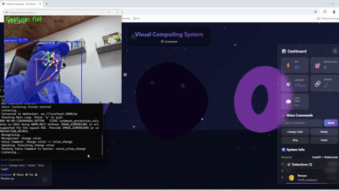
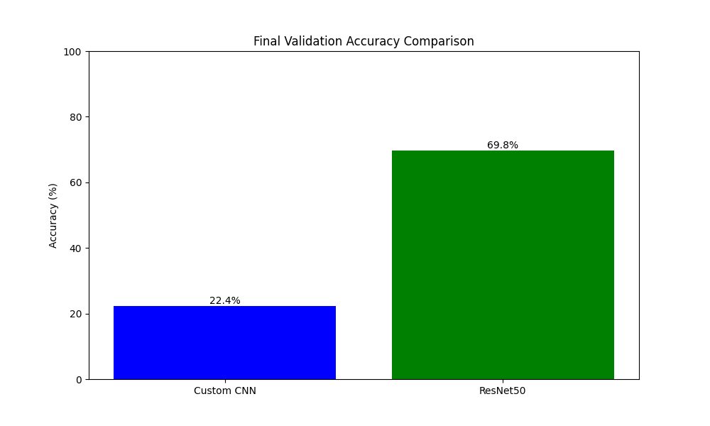
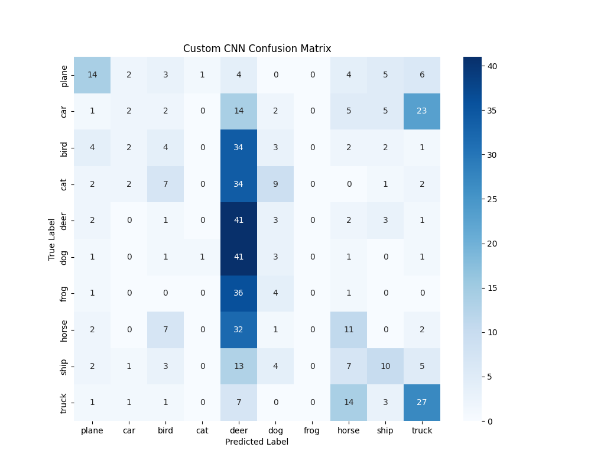
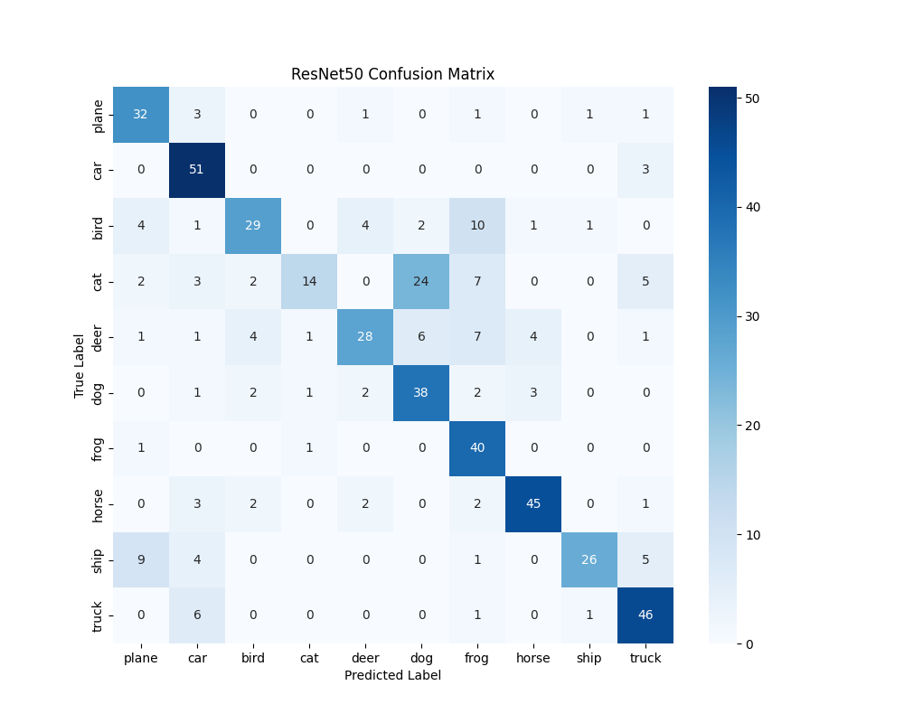

# Advanced Visual Computing Workshop - Integrated System

## 🎯 Project Overview

An integrated visual computing system that combines real-time object detection, multimodal interaction (gestures and voice), 3D visualization, and deep learning capabilities.

## 📸 Evidence & Results

### 🎥 System Demo


> **Full Video**: Watch the high-quality demonstration at [results/videos/taller4.mp4](results/videos/taller4.mp4).

### 🧠 Deep Learning Model Comparison (Phase 3)
We trained and compared two architectures for image classification (CIFAR-10): a Custom CNN and ResNet50 (Transfer Learning).

#### Performance Metrics


#### Confusion Matrices
| Custom CNN | ResNet50 (Transfer Learning) |
|------------|------------------------------|
|  |  |

## 🏗️ Architecture

```mermaid
graph TD
    subgraph "Frontend (React + Three.js)"
        UI[Dashboard UI]
        Scene[3D Scene]
        WS_Client[WebSocket Client]
    end

    subgraph "Backend (Python FastAPI)"
        WS_Server[WebSocket Server]
        
        subgraph "Vision Pipeline"
            YOLO[YOLOv8 Detection]
            SEG[YOLOv8 Segmentation]
            MP[MediaPipe Gestures]
        end
        
        subgraph "Interaction"
            Voice[Voice Recognition]
            EEG[EEG Simulator]
        end
    end

    UI --> WS_Client
    Scene --> WS_Client
    WS_Client <-->|JSON Messages| WS_Server
    WS_Server <--> "Vision Pipeline"
    WS_Server <--> Interaction
```

## 🚀 Features

### A. Perception & Vision
- ✅ Real-time object detection with YOLOv8
- ✅ Hand gesture recognition with MediaPipe
- ✅ CLIP embeddings visualization (PCA/t-SNE)
- ✅ Annotated results export (JSON + images)

### B. Multimodal Interaction
- ✅ Hand gesture detection and tracking
- ✅ Voice recognition and synthesis
- ✅ Multi-input fusion for scene control

### C. 3D Visualization
- ✅ Interactive 3D scene with React Three Fiber
- ✅ Dynamic overlays based on detections
- ✅ Real-time camera and lighting control

### D. Backend & Communication
- ✅ WebSocket server for real-time data streaming
- ✅ JSON serialization and CSV logging
- ✅ Performance metrics dashboard

### E. Deep Learning
- ✅ Custom CNN training from scratch
- ✅ Fine-tuning with pretrained models (ResNet50)
- ✅ Cross-validation and metrics comparison
- ✅ Visual results and confusion matrices

### F. Visual Optimization
- ✅ FPS monitoring and performance metrics
- ✅ Efficient rendering pipeline
- ✅ Resource usage tracking

## 📦 Installation

### Backend Setup

```bash
cd python
python -m venv venv
source venv/bin/activate  # On Windows: venv\Scripts\activate
pip install -r requirements.txt
```

### Frontend Setup

```bash
cd threejs
npm install
```

## 🎮 Usage

### Automatic Start (Recommended)
Run the `run_phase4.bat` script in the root directory. This will launch the Server, Frontend, and Vision Backend automatically.

### Manual Start

#### 1. Start the Backend Server
```bash
cd python/websockets_api
python server.py
```

#### 2. Start the Frontend
```bash
cd threejs
npm run dev
```

#### 3. Start the Vision Pipeline
```bash
cd python/utils
python integrated_demo.py
```

## 🎨 Interaction Controls

- **Voice Commands**:
  - "Change Color" - Changes scene colors
  - "Rotate" - Rotates objects
  - "Stop" - Stops animations
  - "Reset" - Resets the scene
  
- **Hand Gestures**:
  - ✌️ **Peace Sign** - Change Color
  - ✋ **Open Palm** - Rotate Object
  - ✊ **Fist** - Stop Animation
  - 👍 **Thumbs Up** - Reset Scene

## 📊 Modules

### Detection Module
Location: `python/detection/`
- YOLOv8 object detection
- Real-time webcam processing
- Bounding box visualization

### Training Module
Location: `python/training/`
- Custom CNN implementation
- Transfer learning with ResNet50
- Model evaluation and comparison

### MediaPipe Voice Module
Location: `python/mediapipe_voice/`
- Hand gesture recognition
- Voice command processing
- Multi-input fusion

### WebSocket API
Location: `python/websockets_api/`
- FastAPI server
- WebSocket connections
- Real-time data streaming

### Dashboard
Location: `python/dashboards/`
- Performance metrics
- Live FPS monitoring
- Detection statistics

## 📈 Performance Metrics

- **FPS**: Real-time frame rate monitoring
- **Latency**: End-to-end processing time
- **Detection Accuracy**: Object detection confidence scores
- **Model Performance**: Training/validation metrics

## 🎥 Deliverables

- ✅ Functional detection and segmentation
- ✅ Voice and gesture interaction
- ✅ Trained CNN and fine-tuned model
- ✅ 3D interactive scenes
- ✅ Metrics dashboard
- ✅ Demo video (30-60s)
- ✅ 6+ GIFs demonstrating features
- ✅ Complete documentation

## 📚 Documentation

- [Architecture](docs/ARCHITECTURE.md) - System design and components
- [Evidence](docs/EVIDENCIAS.md) - Visual results and demonstrations
- [Metrics](docs/METRICAS.md) - Performance analysis
- [Prompts](docs/PROMPTS.md) - AI assistance log
- [Demo Routines](docs/RUTINAS_DEMO.md) - Demonstration scripts

## 🛠️ Tech Stack

- **Backend**: Python 3.10+, FastAPI, WebSockets
- **Computer Vision**: OpenCV, YOLOv8, MediaPipe
- **Deep Learning**: PyTorch, torchvision
- **Frontend**: React, Three.js, React Three Fiber
- **Visualization**: Plotly, Matplotlib, Seaborn

## 📝 License

MIT License - Educational Project

## 👥 Authors

Visual Computing Workshop - 2025

---

**Note**: This project was developed as part of an advanced visual computing course, integrating multiple AI and computer vision technologies into a cohesive interactive system.
