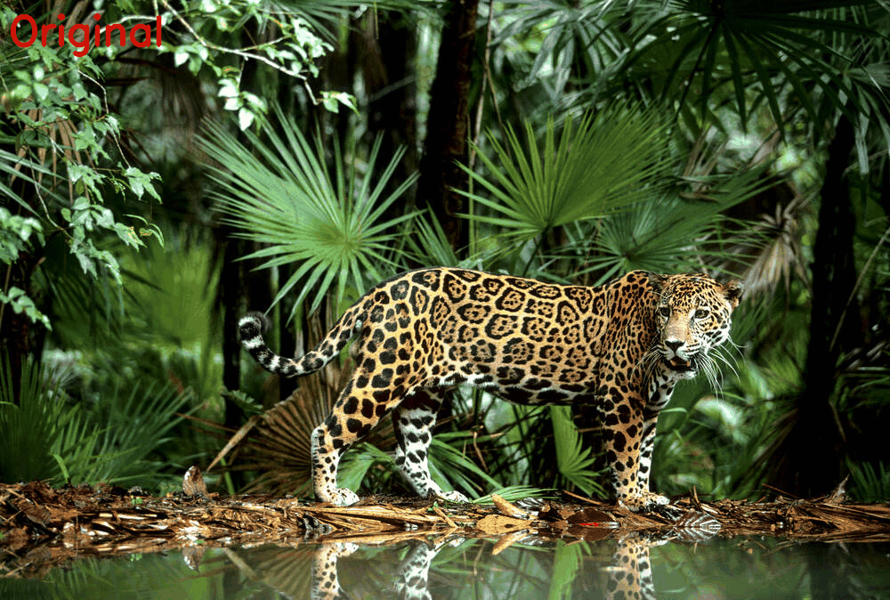
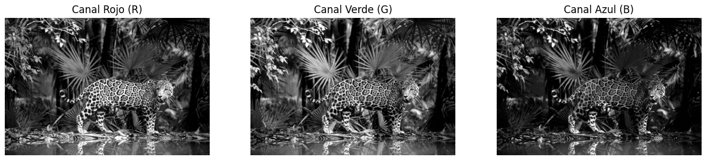

# Final – Computación Visual

## Punto 1 – Python

### Descripción
Se implementó un pipeline de procesamiento de imágenes utilizando OpenCV.
1. **Carga:** Se carga una imagen de un Jaguar.
2. **Filtros:** Se aplicó un filtro de suavizado (Gaussian Blur) para reducir ruido y un filtro de realce de bordes (Sharpening) para destacar detalles del pelaje.
3. **Canales:** Se separaron los canales RGB para analizar la contribución de cada color.
4. **Morfología:** Se binarizó la imagen y se aplicaron operaciones de Dilatación (engrosar) y Erosión (adelgazar) sobre la máscara binaria.
5. **Animación:** Se generó un GIF que muestra la secuencia de transformaciones.

### Resultados

En el **canal rojo**, las zonas claras corresponden a partes de la imagen con altas intensidades de rojo, como áreas iluminadas del pelaje del jaguar.
En el **canal verde**, las zonas claras pueden coincidir con vegetación o partes del fondo.
En el **canal azul**, generalmente las intensidades son menores; las áreas oscuras corresponden al pelaje y sombras, mientras las más claras a reflejos o puntos de luz azulada.

Las diferencias permiten identificar qué partes de la imagen son dominadas por cada componente de color.

---

## Punto 2 – Three.js

### Descripción
Se creó una escena 3D interactiva con las siguientes características:
- **Escena:** Composición con un cubo, una esfera y un cono sobre un plano.
- **Texturas:** Se aplicó una textura de madera al suelo y una textura metálica al cubo y la esfera.
- **Iluminación:** Luz ambiental suave y una luz direccional que proyecta sombras.
- **Animación:**
  - El cubo rota sobre sus ejes X e Y.
  - La esfera levita (movimiento sinusoidal en Y).
  - El cono rota en el eje Z.
- **Interacción:**
  - **OrbitControls:** Permite rotar y hacer zoom con el mouse.
  - **Cambio de Cámara:** Al presionar la tecla **'C'**, se alterna entre una vista superior y una vista lateral baja.

### Resultados

### Instrucciones de ejecución

#### Python
1. Navegar a la carpeta `final/python/`.
2. Instalar dependencias: `pip install -r requirements.txt`
3. Ejecutar el script de generación: `python generate_results.py`
4. O abrir el notebook: `jupyter notebook final_python.ipynb`

#### Three.js
1. Navegar a la carpeta `final/threejs/`.
2. Instalar dependencias: `npm install`
3. Ejecutar el servidor de desarrollo: `npm run dev`
4. Abrir la URL que aparece en la terminal (usualmente `http://localhost:5173`).
